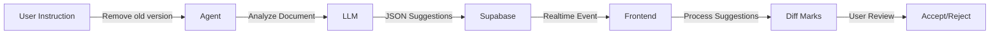

# AI Diff System - Complete Implementation Guide

## 🎯 Project Overview

You're building an AI-powered document editing system where:
- Users give high-level instructions ("remove mentions of old version")
- AI analyzes the document and suggests specific edits
- Users see visual diff marks and can accept/reject each change
- The system maintains perfect position accuracy throughout

## 📚 Documentation Suite

I've created 5 comprehensive documents to ensure implementation success:

### 1. **[AI_DIFF_LLM_RESPONSE_FORMAT.md](./AI_DIFF_LLM_RESPONSE_FORMAT.md)**
Defines the JSON format for LLM responses, including:
- Primary format: Index-based changes (simpler, recommended to start)
- Backup format: Context-based changes (more accurate for complex cases)
- Examples and validation strategies

### 2. **[AI_DIFF_AGENT_INTEGRATION.md](./AI_DIFF_AGENT_INTEGRATION.md)**
Complete guide for modifying your LangGraph agent:
- New edit mode alongside existing generation mode
- Python code for `edit_document` function
- API route updates
- Frontend integration patterns

### 3. **[AI_DIFF_IMPLEMENTATION_PHASES.md](./AI_DIFF_IMPLEMENTATION_PHASES.md)**
Phased approach with test points:
- Phase 1: Mock integration (test the flow)
- Phase 2: Agent edit mode (connect to LLM)
- Phase 3: Frontend processing (handle real suggestions)
- Phase 4: UI polish (loading states, summaries)
- Phase 5: Advanced features (cascading, confidence)

### 4. **[AI_DIFF_TECHNICAL_CHALLENGES.md](./AI_DIFF_TECHNICAL_CHALLENGES.md)**
Solutions to your specific concerns:
- Position accuracy (your main worry)
- Overlapping changes
- LLM response parsing
- Document synchronization
- Complex testing scenarios

## 🚀 Quick Start Path

Based on your requirements for accuracy over speed, here's your recommended path:

### Week 1: Foundation
1. **Day 1-2**: Implement Phase 1 (Mock Integration)
   - Start with `AI_DIFF_IMPLEMENTATION_PHASES.md` Phase 1
   - Use mock data from `AI_DIFF_LLM_RESPONSE_FORMAT.md`
   - Test with the existing DiffExtensionV2 system

2. **Day 3-4**: Complete mock integration testing
   - Verify position accuracy using techniques from `AI_DIFF_TECHNICAL_CHALLENGES.md`
   - Test overlap detection and merging
   - Ensure grouped changes work correctly

### Week 2: Agent Integration
3. **Day 5-7**: Implement Agent Edit Mode
   - Follow `AI_DIFF_AGENT_INTEGRATION.md`
   - Update agent.py with edit_document function
   - Test JSON parsing robustness

4. **Day 8-9**: Connect Frontend to Agent
   - Update API routes
   - Implement realtime subscription handling
   - Test end-to-end flow

### Week 3: Polish & Advanced Features
5. **Day 10-11**: UI Polish
   - Add loading states
   - Implement edit summaries
   - Add confidence indicators

6. **Day 12-14**: Advanced Features & Testing
   - Cascading changes
   - Comprehensive test suite
   - Performance optimization

## ⚠️ Critical Success Factors

### 1. Position Accuracy (Your Main Concern)
```javascript
// ALWAYS validate text before creating marks
if (!validateTextMatch(editor, from, to, expectedText)) {
  console.error('Position mismatch - aborting edit');
  return;
}
```

### 2. Use Existing V2 System
The DiffExtensionV2 with marks (not decorations) is the correct approach:
- [[memory:2772251]] - Marks move with text automatically
- [[memory:2788199]] - Phase 2 is production-ready
- [[memory:2886768]] - Position tracking fix is proven

### 3. Test Frequently
After each phase, run comprehensive tests:
```javascript
// Your test pattern
const result = window.testDiff();
console.log('Marks created:', result.marks);
console.log('Overlays visible:', result.overlays);
```

## 🎨 Architecture Summary



## 📊 Expected Timeline

- **Total Duration**: 2-3 weeks for full implementation
- **MVP (Phase 1-3)**: 1 week
- **Production Ready**: 2 weeks
- **With Advanced Features**: 3 weeks

## 🚨 When to Pause and Test

Stop and test thoroughly when:
1. Mock integration creates first diff marks
2. Agent returns first JSON response
3. First real edit suggestion appears in UI
4. First grouped change is accepted
5. First cascading change works

## 💡 Pro Tips

1. **Start Simple**: Use the index-based format first
2. **Log Everything**: Add extensive console logging during development
3. **Test Incrementally**: Don't move to next phase until current one is solid
4. **Keep Position Tracking**: The existing fix in DiffExtensionV2 is battle-tested
5. **Ask for Help**: If something seems off, pause and investigate

## 🎯 Success Criteria

You'll know it's working when:
- ✅ Mock edits appear at correct positions
- ✅ Agent returns valid JSON suggestions
- ✅ Real edits create accurate diff marks
- ✅ Grouped changes work as units
- ✅ Users can confidently accept changes without fear

---

**Remember**: This is a complex feature, but with these documents and a phased approach, you'll build something powerful and reliable. The key is methodical testing at each phase.

Start with [AI_DIFF_IMPLEMENTATION_PHASES.md](./AI_DIFF_IMPLEMENTATION_PHASES.md) Phase 1 and work your way through. Good luck! 🚀 