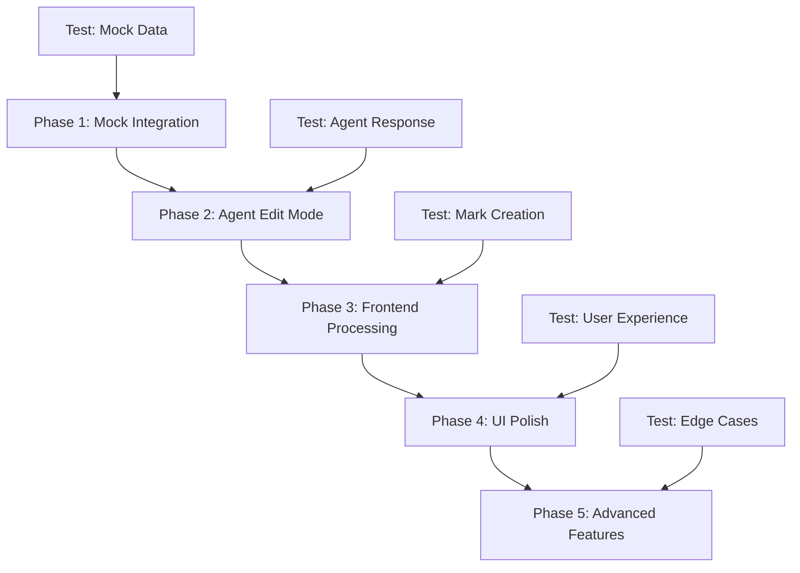

# AI Diff System - Phased Implementation Plan

## 🎯 Overview

This document outlines a careful, phased approach to implementing the AI diff system. Each phase includes specific test points to ensure stability before proceeding.

## 📊 Phase Overview



## 🚀 Phase 1: Mock Integration (1-2 days)

### Goals
- Test the complete flow with mock data
- Ensure diff system handles structured edits
- Validate UI behavior without agent complexity

### Implementation Steps

1. **Create Mock Edit Response Handler**
   ```javascript
   // In DocumentEditorPage.jsx
   const handleMockEdit = () => {
     const mockResponse = {
       edits: [
         {
           id: "edit-001",
           type: "modification",
           target: "old text",
           replacement: "new text",
           occurrences: [1, 3],
           confidence: 0.95,
           reason: "Update terminology"
         }
       ]
     };
     processEditSuggestions(mockResponse);
   };
   ```

2. **Implement Edit Processor**
   ```javascript
   // In services/editProcessor.js
   export function processEditSuggestions(suggestions, editor) {
     const changeManager = editor.storage.diffV2.changeManager;
     
     suggestions.edits.forEach(edit => {
       const positions = findAllOccurrences(editor, edit.target);
       
       // Apply to specified occurrences
       edit.occurrences.forEach(idx => {
         if (positions[idx - 1]) {
           changeManager.addChange({
             id: `${edit.id}-${idx}`,
             groupId: edit.id,  // Group related changes
             type: edit.type,
             from: positions[idx - 1].from,
             to: positions[idx - 1].to,
             originalText: edit.target,
             suggestedText: edit.replacement,
             confidence: edit.confidence,
             reason: edit.reason
           });
         }
       });
     });
   }
   ```

3. **Add Test Button to Editor**
   ```javascript
   <button onClick={handleMockEdit}>
     Test AI Edit (Mock)
   </button>
   ```

### Test Points
- [ ] Mock button creates visible diff marks
- [ ] Multiple occurrences handled correctly
- [ ] Grouped changes share same overlay
- [ ] Accept/reject works for grouped changes
- [ ] Position tracking remains accurate

### Success Criteria
- Can process mock edit suggestions
- Diff marks appear at correct positions
- Grouped edits work as single unit
- No position drift issues

## 🤖 Phase 2: Agent Edit Mode (2-3 days)

### Goals
- Implement edit mode in agent
- Connect frontend to agent
- Handle real LLM responses

### Implementation Steps

1. **Update Agent (Python)**
   - Add edit_document function
   - Update workflow routing
   - Implement JSON response format

2. **Update API Route**
   ```javascript
   // In api/langgraph/start.js
   const { mode = "generate", documentContent } = parsedBody;
   
   // Pass to agent
   input: {
     ...existingInput,
     mode,
     existing_document_content: documentContent
   }
   ```

3. **Update Frontend Integration**
   ```javascript
   // In useAIChat.js
   const requestEdit = async (instruction) => {
     const editor = editorRef.current;
     const currentContent = editor.getHTML();
     
     const response = await fetch('/api/langgraph/start', {
       method: 'POST',
       body: JSON.stringify({
         prompt: instruction,
         mode: 'edit',
         documentContent: currentContent,
         // ... other fields
       })
     });
   };
   ```

### Test Points
- [ ] Agent receives edit mode correctly
- [ ] LLM returns valid JSON format
- [ ] Frontend receives edit suggestions
- [ ] Error handling for invalid responses
- [ ] Timeout handling works

### Success Criteria
- Agent successfully analyzes documents
- Returns properly formatted suggestions
- Frontend receives and logs suggestions
- Graceful error handling

## 🎨 Phase 3: Frontend Processing (2-3 days)

### Goals
- Process real agent suggestions
- Create diff marks from suggestions
- Handle edge cases

### Implementation Steps

1. **Enhanced Edit Processor**
   ```javascript
   // Handle different edit types
   function processEditSuggestions(suggestions, editor) {
     // Validate suggestions
     if (!validateSuggestions(suggestions)) {
       console.error('Invalid suggestions format');
       return;
     }
     
     // Clear previous suggestions
     clearExistingSuggestions(editor);
     
     // Process each edit
     suggestions.edits.forEach(edit => {
       switch(edit.type) {
         case 'modification':
           processModification(edit, editor);
           break;
         case 'deletion':
           processDeletion(edit, editor);
           break;
         case 'addition':
           processAddition(edit, editor);
           break;
       }
     });
     
     // Show summary
     showEditSummary(suggestions.summary);
   }
   ```

2. **Position Finding Algorithm**
   ```javascript
   function findAllOccurrences(editor, target) {
     const doc = editor.state.doc;
     const positions = [];
     
     doc.descendants((node, pos) => {
       if (node.isText) {
         let index = node.text.indexOf(target);
         while (index !== -1) {
           positions.push({
             from: pos + index,
             to: pos + index + target.length
           });
           index = node.text.indexOf(target, index + 1);
         }
       }
     });
     
     return positions;
   }
   ```

3. **Subscription Handler Update**
   ```javascript
   // In realtime subscription
   if (event_data?.content_type === 'edit_suggestions') {
     const suggestions = event_data.suggestions;
     processEditSuggestions(suggestions, editorRef.current);
   }
   ```

### Test Points
- [ ] Exact text matching works
- [ ] Occurrence indexing is accurate
- [ ] All edit types create correct marks
- [ ] Position finding handles nested nodes
- [ ] No duplicate marks created

### Success Criteria
- Real agent suggestions processed correctly
- All occurrence indices resolved
- Different edit types handled
- Robust error handling

## ✨ Phase 4: UI Polish (1-2 days)

### Goals
- Improve visual feedback
- Add loading states
- Enhance user experience

### Implementation Steps

1. **Loading State**
   ```javascript
   const [isProcessingEdit, setIsProcessingEdit] = useState(false);
   
   // Show spinner during agent analysis
   {isProcessingEdit && (
     <div className="absolute inset-0 bg-black/50 flex items-center justify-center">
       <div className="bg-white p-4 rounded-lg">
         <Spinner />
         <p>Analyzing document for edits...</p>
       </div>
     </div>
   )}
   ```

2. **Edit Summary Display**
   ```javascript
   const EditSummary = ({ summary, editCount }) => (
     <div className="bg-blue-50 border-l-4 border-blue-500 p-4 mb-4">
       <h3 className="font-bold">Edit Summary</h3>
       <p>{summary}</p>
       <p className="text-sm text-gray-600">
         {editCount} changes suggested
       </p>
     </div>
   );
   ```

3. **Confidence Indicators**
   ```javascript
   // In overlay
   <div className={`confidence-bar ${getConfidenceColor(change.confidence)}`}>
     {Math.round(change.confidence * 100)}% confident
   </div>
   ```

### Test Points
- [ ] Loading states appear/disappear correctly
- [ ] Summary displays accurate information
- [ ] Confidence scores visible
- [ ] UI remains responsive during processing
- [ ] Error states handled gracefully

### Success Criteria
- Smooth user experience
- Clear visual feedback
- No UI glitches
- Informative error messages

## 🚀 Phase 5: Advanced Features (2-3 days)

### Goals
- Implement cascading changes
- Add confidence thresholds
- Support complex edit patterns

### Implementation Steps

1. **Cascading Change Handler**
   ```javascript
   function handleAcceptChange(changeId) {
     const change = changeManager.getChange(changeId);
     
     // Accept the change
     acceptChange(changeId);
     
     // Handle cascading
     if (change.cascades) {
       change.cascades.forEach(dependentId => {
         // Remove dependent changes
         changeManager.removeChange(dependentId);
       });
     }
     
     // Update dependent changes
     updateDependentPositions(changeId);
   }
   ```

2. **Confidence Threshold Setting**
   ```javascript
   const [confidenceThreshold, setConfidenceThreshold] = useState(0.7);
   
   // Filter low confidence
   const visibleEdits = edits.filter(e => e.confidence >= confidenceThreshold);
   ```

3. **Contextual Edit Support**
   ```javascript
   // For backup format
   function processContextualEdit(edit, editor) {
     const matches = findWithContext(
       editor,
       edit.searchPattern
     );
     
     matches.forEach(match => {
       createDiffMark(match, edit);
     });
   }
   ```

### Test Points
- [ ] Cascading changes work correctly
- [ ] Confidence filtering works
- [ ] Complex patterns match accurately
- [ ] Performance remains good
- [ ] No memory leaks

### Success Criteria
- Advanced features work reliably
- System remains performant
- Good user experience maintained

## 🧪 Testing Strategy

### Unit Tests
```javascript
describe('Edit Processor', () => {
  test('processes modification edits', () => {
    const mockEdit = { /* ... */ };
    const result = processModification(mockEdit, mockEditor);
    expect(result.marks).toHaveLength(2);
  });
  
  test('handles invalid suggestions gracefully', () => {
    const invalid = { edits: null };
    expect(() => processEditSuggestions(invalid)).not.toThrow();
  });
});
```

### Integration Tests
1. Create test document
2. Send edit request to agent
3. Verify suggestions received
4. Apply suggestions
5. Verify final document

### Manual Test Scenarios
- [ ] "Remove all mentions of X"
- [ ] "Update version numbers"
- [ ] "Make tone more formal"
- [ ] "Fix grammar errors"
- [ ] "Add section about Y"

## 📈 Success Metrics

- **Accuracy**: 90%+ of edits at correct positions
- **Performance**: < 2s to process suggestions
- **Reliability**: < 1% error rate
- **UX**: 80%+ user satisfaction

## 🚨 Risk Mitigation

1. **Position Accuracy**
   - Use exact text matching
   - Validate with hashes
   - Test extensively

2. **LLM Response Variability**
   - Robust JSON parsing
   - Clear prompt engineering
   - Fallback strategies

3. **Performance Issues**
   - Limit document size
   - Optimize position finding
   - Use web workers if needed

4. **User Confusion**
   - Clear UI indicators
   - Helpful tooltips
   - Undo functionality

This phased approach ensures each component is thoroughly tested before moving forward, minimizing risk and maximizing success. 