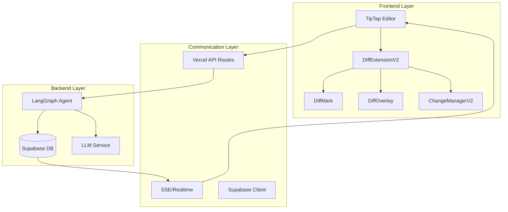
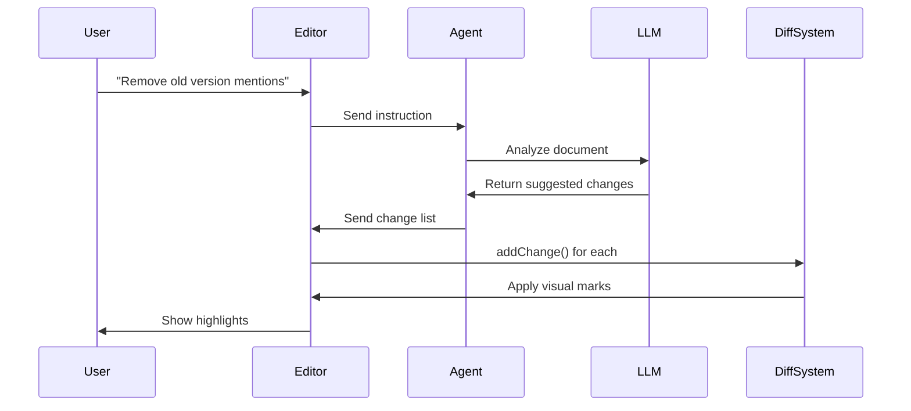
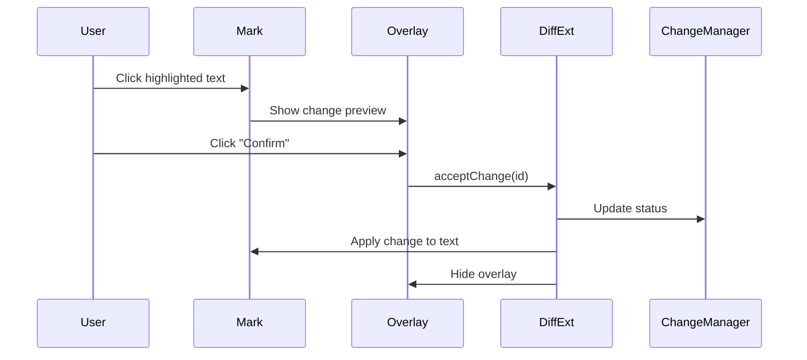

# AI Diff System Architecture - Complete Component Map

## 🏗️ System Overview

The AI Diff System is a sophisticated document editing framework that allows AI agents to suggest changes that users can review and accept/reject. It consists of multiple interconnected layers working in harmony.



## 🧩 Component Deep Dive

### 1. TipTap Editor (`DocumentEditorPage.jsx`)

The foundation - a rich text editor with document editing capabilities.

**Key Responsibilities:**
- Manages document content as HTML
- Handles user input and formatting
- Integrates extensions like DiffExtensionV2
- Provides editor state and commands

**Integration Points:**
```javascript
const editor = useEditor({
  extensions: [
    StarterKit,
    DiffExtension, // Our diff system
    // ... other extensions
  ],
  content: documentData?.content || '',
  onUpdate: ({ editor }) => {
    setIsDirty(true)
    // Triggers auto-save
  }
})
```

### 2. DiffExtensionV2 (`src/extensions/DiffExtension/DiffExtensionV2.js`)

The main orchestrator of the diff system. This TipTap extension manages the entire diff workflow.

**Key Responsibilities:**
- Manages diff mode state (on/off)
- Coordinates between sub-components
- Provides commands for change management
- Handles position tracking and updates

**Critical Features:**
```javascript
// Commands exposed to the editor
commands: {
  toggleDiffMode: () => { /* Enable/disable diff visualization */ },
  addChange: (change) => { /* Add a single change */ },
  acceptChange: (changeId) => { /* Accept a change */ },
  rejectChange: (changeId) => { /* Reject a change */ }
}
```

**Storage Architecture:**
```javascript
storage: {
  isActive: boolean,              // Diff mode state
  changeManager: ChangeManagerV2, // Change tracking
  overlayManager: DiffOverlay,    // UI overlays
  getEditor: () => editor,        // Dynamic editor reference
  updateMarks: () => {},          // Re-render all marks
  applyMarkForChange: () => {}    // Apply single mark
}
```

### 3. DiffMark (`src/extensions/DiffExtension/DiffMark.js`)

A TipTap Mark that creates visual highlights in the document.

**Why Marks Over Decorations:**
- **Automatic Position Tracking**: Marks move with text as it changes
- **Part of Document Model**: Survive undo/redo operations
- **Native TipTap Support**: Work with all editor features

**Mark Attributes:**
```javascript
attributes: {
  type: 'addition' | 'deletion' | 'modification',
  changeId: 'unique-identifier',
  status: 'pending' | 'accepted' | 'rejected',
  originalText: 'text before change',
  suggestedText: 'text after change'
}
```

**Visual Rendering:**
- **Green** (#10b981): Additions
- **Red** (#ef4444): Deletions with strikethrough
- **Cyan** (#06b6d4): Modifications

### 4. DiffOverlay (`src/extensions/DiffExtension/DiffOverlay.jsx`)

React component system for interactive UI overlays.

**Key Features:**
- React Portals for proper z-index management
- Positioned relative to marked text
- Handles accept/reject actions
- Shows change preview

**Interaction Flow:**
1. User clicks on highlighted text
2. Overlay appears with change details
3. User clicks Confirm/Decline
4. Action triggers command in DiffExtensionV2
5. Mark is updated/removed

### 5. ChangeManagerV2 (`src/services/ChangeManagerV2.js`)

Centralized state management for all changes.

**Data Structure:**
```javascript
{
  changes: Map<changeId, {
    id: string,
    type: 'addition' | 'deletion' | 'modification',
    position: { from: number, to: number },
    originalText: string,
    suggestedText: string,
    status: 'pending' | 'accepted' | 'rejected',
    createdAt: Date,
    metadata: Object
  }>,
  batches: Map<batchId, changeId[]>
}
```

**Key Methods:**
- `addChange()`: Register new change
- `getChanges()`: Filter and retrieve changes
- `acceptChange()`: Mark as accepted
- `rejectChange()`: Mark as rejected
- `subscribe()`: Listen for change events

## 🔄 Data Flow Scenarios

### Scenario 1: AI Suggests Changes



### Scenario 2: User Reviews Changes



## 🔌 Integration Points

### 1. Agent Communication

**Current Architecture:**
```javascript
// Frontend calls agent
const response = await fetch('/api/langgraph/start', {
  method: 'POST',
  body: JSON.stringify({ prompt, accountData, documentId })
})

// Agent writes to Supabase
await supabase.table('chat_messages').insert({
  message_type: 'event',
  event_data: { type: 'generated', content: suggestions }
})

// Frontend receives via realtime
subscription.on('INSERT', (payload) => {
  if (payload.new.event_data?.type === 'generated') {
    processSuggestions(payload.new.event_data.content)
  }
})
```

### 2. Position Tracking Strategy

**The Challenge:**
Text positions change as the document is edited. The system uses multiple strategies:

1. **Marks (Primary)**: Let TipTap handle position updates
2. **Dynamic Lookup**: `findMarkPositionById()` finds current positions
3. **Validation**: Check positions before operations
4. **Graceful Failure**: Remove orphaned changes

**Position Fix Implementation:**
```javascript
const findMarkPositionById = (editor, changeId) => {
  let found = null;
  editor.state.doc.descendants((node, pos) => {
    const diffMark = node.marks.find(mark => 
      mark.type.name === 'diffMark' && 
      mark.attrs.changeId === changeId
    );
    if (diffMark) {
      found = { from: pos, to: pos + node.nodeSize };
      return false; // Stop searching
    }
  });
  return found;
};
```

### 3. State Synchronization

**Local State (ChangeManagerV2):**
- Immediate updates
- Memory-based storage
- Fast UI response

**Future: Persistent State (Supabase):**
```sql
-- Planned schema
CREATE TABLE document_changes (
  id UUID PRIMARY KEY,
  document_id UUID REFERENCES documents(id),
  change_id TEXT UNIQUE,
  type TEXT CHECK (type IN ('addition', 'deletion', 'modification')),
  position JSONB,
  original_text TEXT,
  suggested_text TEXT,
  status TEXT DEFAULT 'pending',
  created_at TIMESTAMPTZ DEFAULT NOW()
);
```

## 🚨 Critical Considerations

### 1. Position Drift

**Problem**: Stored positions become invalid as text changes.

**Solution**: Always look up current positions:
```javascript
// DON'T: Use stored position
const { from, to } = change.position;

// DO: Find current position
const currentPos = findMarkPositionById(editor, change.id);
const { from, to } = currentPos || change.position;
```

### 2. Event Propagation

**Problem**: Click events can bubble and cause focus issues.

**Solution**: Proper event handling:
```javascript
// In overlay buttons
onMouseDown={(e) => {
  e.preventDefault();
  e.stopPropagation();
  handleAction();
}}
```

### 3. Memory Management

**Problem**: Overlays and event listeners can leak.

**Solution**: Cleanup on unmount:
```javascript
useEffect(() => {
  // Setup
  return () => {
    // Cleanup: unmount React roots, remove listeners
  };
}, []);
```

## 🎯 Extension Points for AI Integration

### 1. Change Generation

The system is designed to receive changes in this format:
```javascript
{
  type: 'modification',
  position: { from: 100, to: 110 },
  originalText: 'old text',
  suggestedText: 'new text',
  metadata: {
    confidence: 0.95,
    reason: 'Updated to match new API version'
  }
}
```

### 2. Batch Operations

For multiple related changes:
```javascript
editor.commands.addChangeBatch('api-update-v2', [
  { type: 'modification', ... },
  { type: 'deletion', ... },
  // ... more changes
]);
```

### 3. Custom Processors

Future enhancement points:
```javascript
// In DiffExtensionV2
addOptions() {
  return {
    onRequestEdit: async (instruction) => {
      // Custom AI processing
    },
    onAcceptChange: async (change) => {
      // Custom accept logic
    },
    onRejectChange: async (change) => {
      // Custom reject logic
    }
  }
}
```

## 🔮 Future Architecture Considerations

### 1. Collaborative Editing
- Changes need user attribution
- Conflict resolution for overlapping changes
- Real-time sync via Supabase

### 2. Change History
- Persist all changes to database
- Time-travel debugging
- Analytics on acceptance rates

### 3. Smart Grouping
- Group related changes
- Bulk accept/reject
- Dependency tracking between changes

### 4. AI Learning
- Track which changes get accepted
- Improve suggestions over time
- User preference learning

This architecture provides a solid foundation for sophisticated AI-powered document editing while maintaining user control and system reliability. 