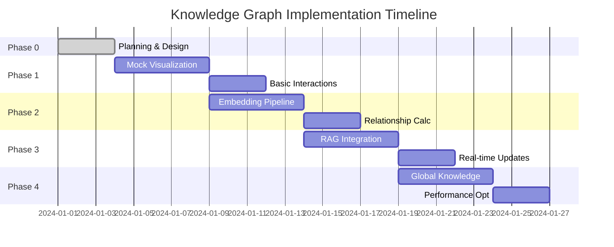

# Knowledge Graph Implementation Plan

## Executive Summary

This document outlines a phased implementation approach for adding an interactive knowledge graph visualization to the SE Auto MVP. The plan is designed to deliver value incrementally while minimizing risk and maintaining system stability.

## Implementation Phases Overview



## Phase 0: Planning & Architecture (Current)

### Objectives
- Complete system design
- Finalize technical decisions
- Set up development environment

### Deliverables
1. ✅ Architecture Analysis Document
2. ✅ System Design Document
3. ✅ Implementation Plan (this document)
4. ⬜ Database migration scripts
5. ⬜ API endpoint designs

### Tasks
```typescript
// 1. Create database migration
CREATE MIGRATION add_graph_support:
  - Add embedding column to account_data_sources
  - Create document_relationships table
  - Create knowledge_clusters table
  - Create global_knowledge_base table
  - Add necessary indexes

// 2. Set up development dependencies
npm install:
  - react-force-graph-3d
  - openai (for embeddings)
  - d3-force-3d
  - @supabase/realtime-js (if not already)

// 3. Create feature flag
FEATURE_FLAGS = {
  KNOWLEDGE_GRAPH: false,
  EMBEDDINGS: false,
  GLOBAL_KNOWLEDGE: false
}
```

## Phase 1: Mock Visualization (Week 1)

### Objectives
- Build visual foundation without RAG
- Prove UX concept
- Get stakeholder buy-in

### Implementation Steps

#### 1.1 Create Base Graph Component
```typescript
// src/components/KnowledgeGraph/KnowledgeGraph.jsx
const KnowledgeGraph = ({ accountId }) => {
  const [graphData, setGraphData] = useState({ nodes: [], links: [] });
  
  // Load mock data initially
  useEffect(() => {
    const mockData = generateMockGraphData(accountId);
    setGraphData(mockData);
  }, [accountId]);
  
  return (
    <ForceGraph3D
      graphData={graphData}
      nodeLabel="name"
      nodeAutoColorBy="type"
      onNodeClick={handleNodeClick}
    />
  );
};
```

#### 1.2 Mock Data Generator
```typescript
// src/utils/mockGraphData.js
export const generateMockGraphData = (accountId) => {
  // Create nodes from existing documents
  const nodes = documents.map(doc => ({
    id: doc.id,
    name: doc.file_name,
    type: doc.file_type,
    val: Math.random() * 20 + 10,
    color: getColorByType(doc.file_type)
  }));
  
  // Create fake relationships
  const links = [];
  nodes.forEach((node, i) => {
    // Connect to 2-3 random other nodes
    const connections = Math.floor(Math.random() * 3) + 1;
    for (let j = 0; j < connections; j++) {
      const target = nodes[Math.floor(Math.random() * nodes.length)];
      if (target.id !== node.id) {
        links.push({
          source: node.id,
          target: target.id,
          value: Math.random()
        });
      }
    }
  });
  
  return { nodes, links };
};
```

#### 1.3 Integrate into ProspectDetailPage
```typescript
// Add tab for graph view
<Tabs>
  <Tab label="List View">
    {/* Existing file list */}
  </Tab>
  <Tab label="Knowledge Graph">
    <KnowledgeGraph accountId={id} />
  </Tab>
</Tabs>
```

#### 1.4 Integrate into AccountDashboard
```typescript
// Add after accounts grid
// src/pages/AccountDashboard.jsx

// Add state for global documents
const [globalDocuments, setGlobalDocuments] = useState([]);

// Fetch global knowledge on mount
useEffect(() => {
  fetchGlobalDocuments();
}, []);

// Render below accounts grid
<div className="mt-12 glass-panel p-8">
  <h2 className="text-3xl font-light text-white mb-6">
    🌐 Company Knowledge Base
  </h2>
  <KnowledgeGraph 
    accountId="global"
    documents={globalDocuments}
    viewMode="global"
    height={500}
    showUpload={false}
  />
</div>
```

### Success Criteria
- [ ] Graph renders with existing documents
- [ ] Basic interactions work (zoom, pan, click)
- [ ] Appears correctly in both locations
- [ ] Different visual styles for account vs global view
- [ ] Stakeholders excited about concept
- [ ] No impact on existing functionality

## Phase 2: Embedding Pipeline (Week 2)

### Objectives
- Add real semantic relationships
- Integrate OpenAI embeddings
- Calculate actual similarities

### Implementation Steps

#### 2.1 Create Embedding Service
```typescript
// src/services/embeddingService.js
class EmbeddingService {
  constructor() {
    this.openai = new OpenAI({
      apiKey: process.env.REACT_APP_OPENAI_API_KEY
    });
  }
  
  async generateEmbedding(text) {
    const response = await this.openai.embeddings.create({
      model: 'text-embedding-ada-002',
      input: text.slice(0, 8000), // Limit length
    });
    
    return response.data[0].embedding;
  }
  
  async processDocument(document) {
    // Extract text content
    const text = this.extractText(document.content);
    
    // Generate embedding
    const embedding = await this.generateEmbedding(text);
    
    // Extract key concepts (simple version)
    const concepts = this.extractConcepts(text);
    
    return { embedding, concepts };
  }
}
```

#### 2.2 Update Document Processor
```typescript
// Modify documentProcessor.js
const processFile = async (file, progressCallback) => {
  // Existing processing...
  
  if (FEATURE_FLAGS.EMBEDDINGS) {
    progressCallback(70, 'Generating embeddings...');
    
    const embeddingData = await embeddingService.processDocument({
      content: html,
      metadata: extractedMetadata
    });
    
    metadata.embedding = embeddingData.embedding;
    metadata.key_concepts = embeddingData.concepts;
  }
  
  return { html, metadata };
};
```

#### 2.3 Create Relationship Calculator
```typescript
// src/services/relationshipService.js
class RelationshipService {
  calculateCosineSimilarity(a, b) {
    const dotProduct = a.reduce((sum, val, i) => sum + val * b[i], 0);
    const normA = Math.sqrt(a.reduce((sum, val) => sum + val * val, 0));
    const normB = Math.sqrt(b.reduce((sum, val) => sum + val * val, 0));
    return dotProduct / (normA * normB);
  }
  
  async findRelationships(newDoc, existingDocs) {
    const relationships = [];
    
    for (const existing of existingDocs) {
      if (existing.metadata?.embedding) {
        const similarity = this.calculateCosineSimilarity(
          newDoc.embedding,
          existing.metadata.embedding
        );
        
        if (similarity > 0.7) {
          relationships.push({
            source_doc_id: newDoc.id,
            target_doc_id: existing.id,
            similarity_score: similarity,
            relationship_type: 'semantic'
          });
        }
      }
    }
    
    return relationships;
  }
}
```

### Success Criteria
- [ ] Embeddings generated for new uploads
- [ ] Real similarity scores calculated
- [ ] Relationships stored in database
- [ ] Graph shows actual semantic connections

## Phase 3: RAG Integration (Week 3)

### Objectives
- Connect to Supabase pgvector
- Show which documents AI accesses
- Real-time visualization updates

### Implementation Steps

#### 3.1 Database Setup
```sql
-- Enable pgvector extension
CREATE EXTENSION IF NOT EXISTS vector;

-- Update schema for vector storage
ALTER TABLE account_data_sources 
ADD COLUMN embedding vector(1536);

-- Create vector similarity function
CREATE OR REPLACE FUNCTION match_documents(
  query_embedding vector(1536),
  match_threshold float,
  match_count int
)
RETURNS TABLE (
  id uuid,
  similarity float
)
LANGUAGE sql STABLE
AS $$
  SELECT
    account_data_sources.id,
    1 - (account_data_sources.embedding <=> query_embedding) as similarity
  FROM account_data_sources
  WHERE 1 - (account_data_sources.embedding <=> query_embedding) > match_threshold
  ORDER BY similarity DESC
  LIMIT match_count;
$$;
```

#### 3.2 Update Agent Retrieval
```python
# agent/nodes/retrieval.py enhancement
async def retrieve_documents(state: AgentState) -> AgentState:
    # Existing retrieval...
    
    # NEW: Track which documents are accessed
    accessed_docs = []
    
    for doc in documents:
        accessed_docs.append({
            "id": doc["id"],
            "file_name": doc["file_name"],
            "access_time": datetime.now().isoformat()
        })
    
    # Log access event for visualization
    await supabase_manager.log_event(
        document_id=state["document_id"],
        event_type="documents_accessed",
        content=f"Accessing {len(accessed_docs)} documents",
        data={
            "accessed_documents": accessed_docs,
            "for_task": state["task"][:100]
        }
    )
```

#### 3.3 Real-time Graph Updates
```typescript
// src/components/KnowledgeGraph/useGraphRealtime.js
const useGraphRealtime = (accountId) => {
  const [accessedNodes, setAccessedNodes] = useState(new Set());
  
  useEffect(() => {
    const channel = supabase
      .channel(`graph-${accountId}`)
      .on('postgres_changes', {
        event: 'INSERT',
        schema: 'public',
        table: 'chat_messages',
        filter: `message_type=eq.event`
      }, (payload) => {
        if (payload.new.event_data?.type === 'documents_accessed') {
          const docs = payload.new.event_data.accessed_documents;
          
          // Highlight accessed nodes
          docs.forEach(doc => {
            setAccessedNodes(prev => new Set([...prev, doc.id]));
            
            // Remove highlight after 3 seconds
            setTimeout(() => {
              setAccessedNodes(prev => {
                const next = new Set(prev);
                next.delete(doc.id);
                return next;
              });
            }, 3000);
          });
        }
      })
      .subscribe();
      
    return () => channel.unsubscribe();
  }, [accountId]);
  
  return accessedNodes;
};
```

### Success Criteria
- [ ] Vector similarity search working
- [ ] Graph pulses when docs accessed
- [ ] Agent retrieval visible in real-time
- [ ] Performance acceptable

## Phase 4: Global Knowledge & Polish (Week 4)

### Objectives
- Add company-wide knowledge base
- Optimize performance
- Polish interactions

### Implementation Steps

#### 4.1 Global Knowledge UI
```typescript
// src/components/KnowledgeGraph/GlobalKnowledgeToggle.jsx
const GlobalKnowledgeToggle = ({ onViewChange }) => {
  return (
    <div className="view-controls glass-panel p-2">
      <button onClick={() => onViewChange('account')}>
        Account Only
      </button>
      <button onClick={() => onViewChange('global')}>
        Company Knowledge
      </button>
      <button onClick={() => onViewChange('hybrid')}>
        Both
      </button>
    </div>
  );
};
```

#### 4.2 Upload Destination Picker
```typescript
// src/components/UploadDestinationModal.jsx
const UploadDestinationModal = ({ file, onSelect }) => {
  return (
    <Modal>
      <h3>Where should this knowledge live?</h3>
      
      <button onClick={() => onSelect('global')} className="upload-option">
        <span>🌐</span>
        <h4>Company Knowledge Base</h4>
        <p>Available to ALL accounts</p>
      </button>
      
      <button onClick={() => onSelect('account')} className="upload-option">
        <span>📁</span>
        <h4>This Account Only</h4>
        <p>Private to this client</p>
      </button>
    </Modal>
  );
};
```

#### 4.3 Performance Optimizations
```typescript
// src/components/KnowledgeGraph/optimizations.js

// 1. Virtualization for large graphs
const VirtualizedGraph = ({ nodes, links }) => {
  const visibleNodes = useMemo(() => {
    return nodes.filter(node => {
      // Only render nodes in viewport
      return isInViewport(node.position);
    });
  }, [nodes, viewport]);
};

// 2. Level of detail
const getNodeDetail = (distance) => {
  if (distance < 50) return 'high';
  if (distance < 200) return 'medium';
  return 'low';
};

// 3. Debounced updates
const debouncedGraphUpdate = debounce((newData) => {
  setGraphData(newData);
}, 100);
```

### Success Criteria
- [ ] Global knowledge base functional
- [ ] 1000+ nodes perform well
- [ ] Smooth animations
- [ ] Intuitive interactions

## Testing Strategy

### Phase 1 Tests
- Visual regression tests
- Interaction tests (zoom, pan, click)
- Mock data generation

### Phase 2 Tests
- Embedding generation accuracy
- Similarity calculation correctness
- API rate limiting

### Phase 3 Tests
- Vector search performance
- Real-time update latency
- Concurrent user handling

### Phase 4 Tests
- Large dataset performance
- Cross-account isolation
- Global knowledge permissions

## Risk Mitigation

### Technical Risks
1. **Embedding Costs**
   - Mitigation: Cache embeddings, batch processing
   
2. **Graph Performance**
   - Mitigation: Start 2D, virtualization, LOD
   
3. **Real-time Overload**
   - Mitigation: Debouncing, event filtering

### UX Risks
1. **Complexity**
   - Mitigation: Progressive disclosure, tutorials
   
2. **Information Overload**
   - Mitigation: Filtering, focus modes

### Business Risks
1. **Scope Creep**
   - Mitigation: Strict phase boundaries
   
2. **User Adoption**
   - Mitigation: Optional feature, gradual rollout

## Success Metrics

### Quantitative
- Graph load time < 2s
- Smooth 60fps interactions
- < 100ms real-time updates
- 90% similarity accuracy

### Qualitative
- "Wow" factor in demos
- Intuitive without training
- Clear value proposition
- Enhances document understanding

## Resource Requirements

### Development
- 1 Senior Frontend Developer (full-time, 4 weeks)
- 1 Backend Developer (part-time, embeddings/API)
- 1 UI/UX Designer (part-time, interactions)

### Infrastructure
- OpenAI API budget ($200/month estimated)
- Supabase pgvector enabled
- CDN for 3D assets

### Tools
- react-force-graph-3d license
- Development/staging environment
- Performance monitoring

## Go/No-Go Criteria

### After Each Phase
- [ ] Core functionality working
- [ ] No regression in existing features
- [ ] Performance acceptable
- [ ] Positive stakeholder feedback
- [ ] Clear path to next phase

## Conclusion

This phased approach allows us to:
1. Validate the concept early with mock data
2. Build real value incrementally
3. Maintain system stability
4. Defer complex decisions
5. Deliver visible progress weekly

The knowledge graph will transform how users perceive and interact with their document context, making the AI's intelligence visible and tangible. 