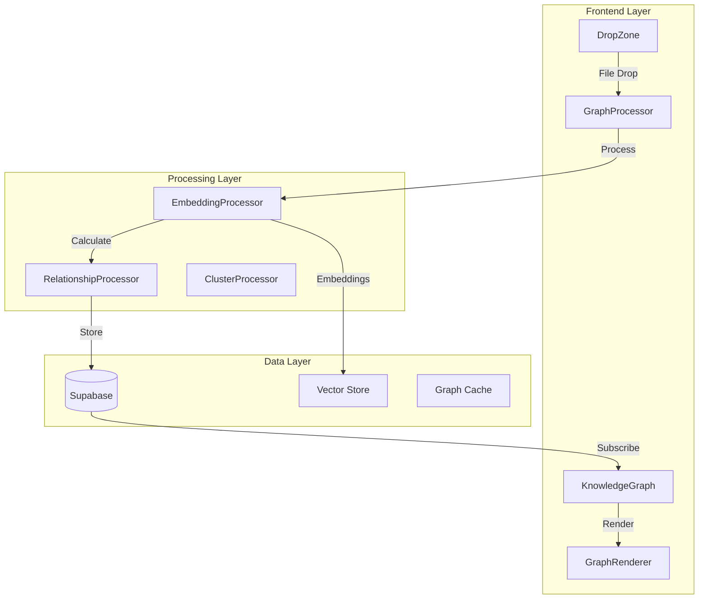
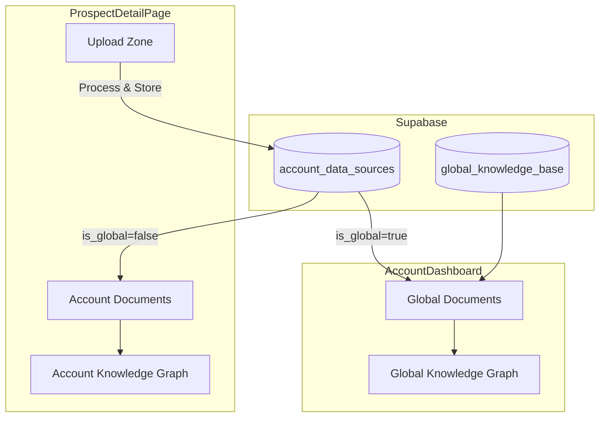

# Knowledge Graph System Design

## Overview

This document outlines the technical design for implementing an interactive knowledge graph visualization system that transforms document uploads into a living, visual knowledge base for the AI agent.

## System Architecture



## Core Components

### 1. Knowledge Graph Visualization Component

#### Component Structure
```typescript
interface KnowledgeGraphProps {
  accountId: string;
  documents: Document[];
  relationships: Relationship[];
  onNodeClick: (node: GraphNode) => void;
  onFileDrop: (file: File, position: Position) => void;
  viewMode: 'account' | 'global' | 'hybrid';
}

interface GraphNode {
  id: string;
  type: 'document' | 'cluster' | 'concept';
  name: string;
  position: { x: number; y: number; z?: number };
  metadata: {
    fileType?: string;
    uploadDate?: Date;
    lastAccessed?: Date;
    usageCount?: number;
    relevanceScore?: number;
    isGlobal?: boolean;
  };
  visual: {
    color: string;
    size: number;
    icon?: string;
    glow?: boolean;
  };
}

interface Relationship {
  source: string;
  target: string;
  strength: number;
  type: 'semantic' | 'reference' | 'temporal' | 'cluster';
  metadata?: {
    sharedConcepts?: string[];
    confidence?: number;
  };
}
```

#### Visualization Library Selection
- **Primary Choice**: react-force-graph-3d
  - 3D capability for future expansion
  - Force-directed layout built-in
  - WebGL performance
  - VR support potential

- **Alternative**: D3.js + custom implementation
  - More control
  - Better for 2D
  - Lighter weight

### 2. Document Processing Pipeline

#### Enhanced Processing Flow
```typescript
class DocumentGraphProcessor {
  async processDocument(file: File, accountId: string): Promise<ProcessingResult> {
    // Phase 1: Extract content
    const content = await extractContent(file);
    
    // Phase 2: Generate embeddings
    const embeddings = await generateEmbeddings(content);
    
    // Phase 3: Extract key concepts
    const concepts = await extractConcepts(content);
    
    // Phase 4: Find relationships
    const relationships = await findRelationships(embeddings, accountId);
    
    // Phase 5: Calculate position
    const position = await calculateOptimalPosition(relationships);
    
    // Phase 6: Determine clusters
    const cluster = await assignCluster(embeddings, concepts);
    
    return {
      document: { ...metadata, embeddings, concepts },
      relationships,
      position,
      cluster
    };
  }
}
```

#### Embedding Generation
```typescript
interface EmbeddingService {
  generateEmbedding(text: string): Promise<number[]>;
  generateChunkEmbeddings(chunks: string[]): Promise<number[][]>;
  model: 'text-embedding-ada-002' | 'text-embedding-3-small';
}

// Implementation using OpenAI
class OpenAIEmbeddingService implements EmbeddingService {
  async generateEmbedding(text: string): Promise<number[]> {
    const response = await openai.embeddings.create({
      model: 'text-embedding-ada-002',
      input: text,
    });
    return response.data[0].embedding;
  }
}
```

### 3. Relationship Detection

#### Similarity Calculation
```typescript
class RelationshipDetector {
  async detectRelationships(
    newDoc: Document,
    existingDocs: Document[]
  ): Promise<Relationship[]> {
    const relationships: Relationship[] = [];
    
    for (const existing of existingDocs) {
      // Cosine similarity between embeddings
      const similarity = cosineSimilarity(
        newDoc.embedding,
        existing.embedding
      );
      
      if (similarity > 0.7) {
        // Extract shared concepts
        const sharedConcepts = findSharedConcepts(
          newDoc.concepts,
          existing.concepts
        );
        
        relationships.push({
          source: newDoc.id,
          target: existing.id,
          strength: similarity,
          type: 'semantic',
          metadata: { sharedConcepts }
        });
      }
    }
    
    return relationships;
  }
}
```

### 4. Graph Layout Algorithm

#### Force-Directed Layout with Constraints
```typescript
class GraphLayoutEngine {
  private forces = {
    charge: d3.forceManyBody().strength(-300),
    link: d3.forceLink().distance(d => 100 / d.strength),
    center: d3.forceCenter(),
    collision: d3.forceCollide().radius(30),
    cluster: this.createClusterForce()
  };
  
  calculateLayout(nodes: GraphNode[], links: Relationship[]): void {
    const simulation = d3.forceSimulation(nodes)
      .force('charge', this.forces.charge)
      .force('link', this.forces.link(links))
      .force('center', this.forces.center)
      .force('collision', this.forces.collision)
      .force('cluster', this.forces.cluster);
      
    // Run simulation
    simulation.tick(300);
  }
  
  private createClusterForce() {
    return (alpha: number) => {
      // Custom force to keep clusters together
      // Global docs gravitate to center
      // Account docs cluster by type
    };
  }
}
```

### 5. Real-time Updates

#### WebSocket Integration
```typescript
class GraphRealtimeManager {
  private channel: RealtimeChannel;
  
  constructor(private accountId: string) {
    this.channel = supabase
      .channel(`graph-${accountId}`)
      .on('postgres_changes', {
        event: '*',
        schema: 'public',
        table: 'account_data_sources'
      }, this.handleDocumentChange)
      .on('postgres_changes', {
        event: '*',
        schema: 'public',
        table: 'document_relationships'
      }, this.handleRelationshipChange)
      .subscribe();
  }
  
  private handleDocumentChange = (payload: any) => {
    if (payload.eventType === 'INSERT') {
      this.animateNodeAppearance(payload.new);
    } else if (payload.eventType === 'DELETE') {
      this.animateNodeRemoval(payload.old);
    }
  };
}
```

## Database Schema

### Enhanced Tables

```sql
-- Enhanced account_data_sources
ALTER TABLE account_data_sources ADD COLUMN IF NOT EXISTS
  embedding vector(1536),
  embedding_model text DEFAULT 'text-embedding-ada-002',
  key_concepts jsonb DEFAULT '[]',
  graph_position jsonb DEFAULT '{"x": 0, "y": 0}',
  cluster_id uuid,
  importance_score float DEFAULT 0.5,
  usage_count integer DEFAULT 0,
  last_accessed_at timestamptz;

-- Document relationships
CREATE TABLE IF NOT EXISTS document_relationships (
  id uuid PRIMARY KEY DEFAULT gen_random_uuid(),
  source_doc_id uuid REFERENCES account_data_sources(id) ON DELETE CASCADE,
  target_doc_id uuid REFERENCES account_data_sources(id) ON DELETE CASCADE,
  similarity_score float NOT NULL,
  relationship_type text NOT NULL,
  shared_concepts jsonb DEFAULT '[]',
  created_at timestamptz DEFAULT now(),
  UNIQUE(source_doc_id, target_doc_id)
);

-- Knowledge clusters
CREATE TABLE IF NOT EXISTS knowledge_clusters (
  id uuid PRIMARY KEY DEFAULT gen_random_uuid(),
  account_id uuid REFERENCES accounts(id) ON DELETE CASCADE,
  name text NOT NULL,
  centroid_embedding vector(1536),
  color text,
  document_count integer DEFAULT 0,
  key_themes jsonb DEFAULT '[]',
  created_at timestamptz DEFAULT now()
);

-- Global knowledge base
CREATE TABLE IF NOT EXISTS global_knowledge_base (
  id uuid PRIMARY KEY DEFAULT gen_random_uuid(),
  file_name text NOT NULL,
  file_type text,
  content text,
  embedding vector(1536),
  metadata jsonb DEFAULT '{}',
  usage_by_accounts jsonb DEFAULT '[]',
  created_at timestamptz DEFAULT now()
);

-- Indexes for performance
CREATE INDEX idx_relationships_source ON document_relationships(source_doc_id);
CREATE INDEX idx_relationships_target ON document_relationships(target_doc_id);
CREATE INDEX idx_embedding_similarity ON account_data_sources USING ivfflat (embedding vector_cosine_ops);
```

## API Design

### Graph Operations API

```typescript
// Vercel API Routes
// /api/graph/process-document
export async function POST(req: Request) {
  const { file, accountId } = await req.json();
  
  // Generate embeddings
  const embedding = await embeddingService.generate(file.content);
  
  // Find relationships
  const relationships = await relationshipService.findSimilar(
    embedding,
    accountId
  );
  
  // Calculate position
  const position = await layoutService.calculatePosition(
    relationships,
    accountId
  );
  
  return Response.json({
    embedding,
    relationships,
    position
  });
}

// /api/graph/layout
export async function POST(req: Request) {
  const { accountId, viewMode } = await req.json();
  
  const layout = await layoutService.getOptimalLayout(
    accountId,
    viewMode
  );
  
  return Response.json(layout);
}
```

## User Experience Design

### Interaction Patterns

1. **Drag & Drop Upload**
   - Drag file over graph
   - Preview connections light up
   - Drop to upload and process
   - Watch integration animation

2. **Node Interactions**
   - Click: Show document details
   - Double-click: Open in editor
   - Hover: Preview connections
   - Right-click: Context menu

3. **Graph Controls**
   - Zoom: Mouse wheel
   - Pan: Click and drag
   - Rotate: Right-click drag (3D)
   - Filter: Toolbar controls

### Visual Hierarchy

```typescript
const nodeVisuals = {
  globalKnowledge: {
    shape: 'diamond',
    baseSize: 20,
    color: '#FFD700',
    glow: true,
    pulseOnAccess: true
  },
  accountDocument: {
    shape: 'sphere',
    baseSize: 15,
    color: (cluster) => clusterColors[cluster],
    glow: false
  },
  concept: {
    shape: 'ring',
    baseSize: 10,
    color: '#00CED1',
    opacity: 0.7
  }
};

const linkVisuals = {
  strong: { width: 3, opacity: 0.8 },
  medium: { width: 2, opacity: 0.6 },
  weak: { width: 1, opacity: 0.4 }
};
```

## Performance Optimization

### Rendering Strategy

1. **Level of Detail (LOD)**
   ```typescript
   class LODRenderer {
     render(nodes: GraphNode[], camera: Camera) {
       const visibleNodes = this.frustumCull(nodes, camera);
       
       return visibleNodes.map(node => {
         const distance = camera.distanceTo(node);
         
         if (distance < 100) {
           return this.renderHighDetail(node);
         } else if (distance < 500) {
           return this.renderMediumDetail(node);
         } else {
           return this.renderLowDetail(node);
         }
       });
     }
   }
   ```

2. **Virtualization**
   - Only render visible nodes
   - Lazy-load relationships
   - Progressive detail loading

3. **Caching**
   - Cache embeddings locally
   - Store layout calculations
   - Reuse relationship data

## Integration with Existing Systems

### Document Upload Enhancement
```typescript
// Enhance existing handleFileSelect
const handleFileSelect = async (files) => {
  const file = files[0];
  
  // Existing processing
  const result = await documentProcessor.processFile(file);
  
  // NEW: Graph processing
  if (GRAPH_ENABLED) {
    const graphData = await graphProcessor.processForGraph(file, result);
    
    // Store graph data
    await supabase
      .from('account_data_sources')
      .update({
        embedding: graphData.embedding,
        key_concepts: graphData.concepts,
        graph_position: graphData.position
      })
      .eq('id', documentId);
      
    // Calculate relationships
    await relationshipService.calculateAndStore(documentId);
  }
};
```

### AI Agent Integration
```typescript
// Enhanced retrieval with graph context
async function retrieve_documents(state: AgentState) {
  const documents = await supabase_manager.retrieve_account_documents(
    account_id
  );
  
  // NEW: Include graph relationships
  const relationships = await getDocumentRelationships(documents);
  
  // Use relationships to improve scoring
  const enhancedScoring = await scoreWithGraphContext(
    documents,
    relationships,
    state.task
  );
  
  return enhancedScoring;
}
```

## Testing Strategy

1. **Unit Tests**
   - Embedding generation
   - Similarity calculations
   - Layout algorithms

2. **Integration Tests**
   - Upload → Process → Display flow
   - Real-time updates
   - Cross-account knowledge

3. **Performance Tests**
   - 1000+ node rendering
   - Layout calculation speed
   - Memory usage

4. **User Experience Tests**
   - Drag-drop interactions
   - Animation smoothness
   - Responsiveness

## Security Considerations

1. **Data Isolation**
   - Maintain account boundaries
   - Secure global knowledge access
   - Audit knowledge sharing

2. **Performance Limits**
   - Rate limit embedding generation
   - Cap graph size per account
   - Throttle animations

## Rollout Strategy

### Phase 1: Foundation (Week 1)
- Database schema updates
- Basic graph component
- Mock data visualization

### Phase 2: Processing (Week 2)
- Embedding generation
- Relationship detection
- Basic layout algorithm

### Phase 3: Interactivity (Week 3)
- Drag-drop upload
- Real-time updates
- Animations

### Phase 4: Enhancement (Week 4)
- Global knowledge
- Advanced layouts
- Performance optimization 

export async function createClient() {
  const cookieStore = await cookies()

  return createServerClient(
    process.env.NEXT_PUBLIC_SUPABASE_URL!,
    process.env.NEXT_PUBLIC_SUPABASE_ANON_KEY!,
    {
      cookies: {
        getAll() {
          return cookieStore.getAll()
        },
        setAll(cookiesToSet) {
          try {
            cookiesToSet.forEach(({ name, value, options }) =>
              cookieStore.set(name, value, options)
            )
          } catch {
            // The `setAll` method was called from a Server Component.
            // This can be ignored if you have middleware refreshing
            // user sessions.
          }
        },
      },
    }
  )
}

## 🎯 Dual Placement Architecture

The Knowledge Graph will be integrated in two strategic locations:

### 1. ProspectDetailPage (Account-Specific View)
```typescript
interface AccountKnowledgeGraphProps {
  accountId: string;
  documents: Document[];
  viewMode?: 'account' | 'global' | 'both';
  onFileDrop: (file: File) => void;
  showUpload: true;
  height?: number;
}
```

**Location**: Replaces/augments the "Context Files" section
**Purpose**: 
- Visualize account-specific documents
- Enable drag-and-drop uploads  
- Show real-time AI document access
- Manage account knowledge base

### 2. AccountDashboard (Global Knowledge View)
```typescript
interface GlobalKnowledgeGraphProps {
  accountId: 'global';
  documents: GlobalDocument[];
  viewMode: 'global';
  showUpload: false;
  height: 500;
  showControls: true;
}
```

**Location**: Below the accounts grid
**Purpose**:
- Display company-wide knowledge base
- Show organizational knowledge assets
- Demonstrate value of shared resources
- No direct upload (managed elsewhere)

### Component Reusability Strategy
```typescript
// Single component handles both use cases
const KnowledgeGraph = ({ 
  accountId,  // 'global' for company-wide view
  documents,
  viewMode = 'account',
  height = 600,
  showControls = true,
  showUpload = true,
  onNodeClick,
  onFileDrop
}: KnowledgeGraphProps) => {
  // Component adapts based on props
}
```

### Data Flow for Dual Placement
