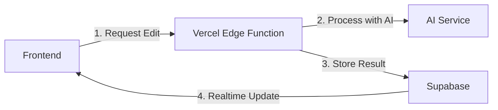

# Vercel → Supabase AI Architecture Plan

## 🏗️ Architecture Overview

Instead of direct API calls to an AI service, the plan is to use a distributed architecture:



## 🎯 Why This Architecture?

### Benefits
1. **Scalability** - Vercel handles AI processing at edge locations
2. **Persistence** - Supabase stores all suggestions for history/analytics
3. **Real-time** - Supabase's built-in realtime for instant updates
4. **Cost Control** - Can queue/batch AI requests
5. **Separation of Concerns** - AI processing separate from data storage

### Current vs Future
```
Current: Frontend → LangGraph → SSE Stream → Frontend
Future:  Frontend → Vercel → AI → Supabase → Realtime → Frontend
```

## 💾 Database Schema

### Supabase Tables

```sql
-- AI edit requests
CREATE TABLE ai_edit_requests (
  id UUID PRIMARY KEY DEFAULT gen_random_uuid(),
  document_id UUID REFERENCES documents(id),
  user_id UUID REFERENCES auth.users(id),
  selection JSONB NOT NULL, -- {from, to, text}
  instruction TEXT NOT NULL,
  status TEXT DEFAULT 'pending', -- pending|processing|completed|failed
  created_at TIMESTAMPTZ DEFAULT NOW()
);

-- AI suggestions
CREATE TABLE ai_suggestions (
  id UUID PRIMARY KEY DEFAULT gen_random_uuid(),
  request_id UUID REFERENCES ai_edit_requests(id),
  suggestions JSONB NOT NULL, -- Array of change objects
  processing_time_ms INTEGER,
  created_at TIMESTAMPTZ DEFAULT NOW()
);

-- Enable realtime
ALTER PUBLICATION supabase_realtime ADD TABLE ai_suggestions;
```

## 🔌 Implementation Details

### Vercel Edge Function

```typescript
// app/api/ai/edit/route.ts
import { createClient } from '@supabase/supabase-js';
import { OpenAI } from 'openai'; // or your AI provider

export async function POST(request: Request) {
  const { documentId, selection, instruction } = await request.json();
  
  // Create request record
  const { data: requestData } = await supabase
    .from('ai_edit_requests')
    .insert({
      document_id: documentId,
      selection,
      instruction,
      user_id: userId
    })
    .select()
    .single();
    
  // Process with AI
  try {
    const suggestions = await processWithAI(selection.text, instruction);
    
    // Store results
    await supabase
      .from('ai_suggestions')
      .insert({
        request_id: requestData.id,
        suggestions: suggestions.map(s => ({
          type: determineChangeType(s),
          originalText: s.original,
          suggestedText: s.replacement,
          position: mapToDocumentPosition(s, selection)
        }))
      });
      
    return Response.json({ 
      requestId: requestData.id,
      status: 'processing' 
    });
    
  } catch (error) {
    await supabase
      .from('ai_edit_requests')
      .update({ status: 'failed' })
      .eq('id', requestData.id);
      
    throw error;
  }
}
```

### Frontend Integration

```javascript
// src/services/VercelSupabaseEditService.js
export class VercelSupabaseEditService {
  constructor(supabase) {
    this.supabase = supabase;
  }
  
  async requestEdit(documentId, selection, instruction) {
    // 1. Send request to Vercel
    const response = await fetch('/api/ai/edit', {
      method: 'POST',
      headers: { 'Content-Type': 'application/json' },
      body: JSON.stringify({ documentId, selection, instruction })
    });
    
    const { requestId } = await response.json();
    
    // 2. Subscribe to results
    return new Promise((resolve, reject) => {
      const channel = this.supabase
        .channel(`ai-suggestions:${requestId}`)
        .on('postgres_changes', {
          event: 'INSERT',
          schema: 'public',
          table: 'ai_suggestions',
          filter: `request_id=eq.${requestId}`
        }, (payload) => {
          // 3. Process suggestions
          const changes = payload.new.suggestions.map(s => ({
            id: crypto.randomUUID(),
            ...s
          }));
          
          channel.unsubscribe();
          resolve(changes);
        })
        .subscribe();
        
      // Timeout after 30 seconds
      setTimeout(() => {
        channel.unsubscribe();
        reject(new Error('AI request timed out'));
      }, 30000);
    });
  }
}
```

## 🔄 Migration Path

1. **Phase 1**: Build Vercel edge function with mock AI
2. **Phase 2**: Set up Supabase tables and realtime
3. **Phase 3**: Create service abstraction layer
4. **Phase 4**: Implement real AI integration
5. **Phase 5**: Add features (caching, history, analytics)

## 🚦 Status Tracking

The system can show real-time status updates:

```javascript
// Show processing status
const [status, setStatus] = useState('idle');

const handleAIEdit = async () => {
  setStatus('requesting');
  
  try {
    const changes = await editService.requestEdit(...);
    setStatus('completed');
    applyChanges(changes);
  } catch (error) {
    setStatus('failed');
  }
};

// UI reflects status
{status === 'requesting' && <LoadingIndicator />}
{status === 'failed' && <ErrorMessage />}
```

## 📊 Future Enhancements

1. **Caching** - Store common edits for instant results
2. **Analytics** - Track most common edit types
3. **History** - Show all edits for a document
4. **Collaboration** - Multiple users see same suggestions
5. **Feedback** - Users rate suggestion quality

This architecture provides a solid foundation for scalable AI-powered editing! 