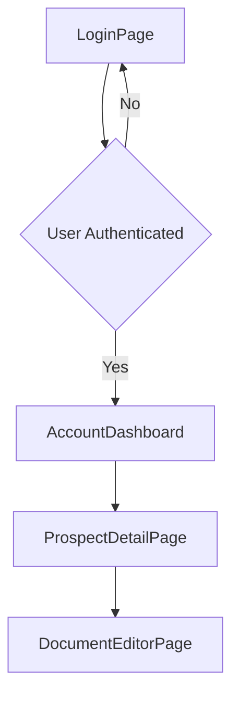
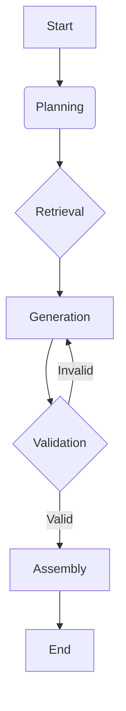

# Software Design Document

This document provides a comprehensive overview of the current state of the codebase. It is intended to be used by an AI coding agent to understand the system's architecture and implementation details when planning and executing development tasks.

## 1. System Overview

The system is a web-based application designed to assist sales engineers by automating the generation of various sales documents. It features a React frontend, a Supabase backend for data persistence and authentication, and a Python-based agent that uses LangGraph for document generation.

## 2. Database Schema

The database is managed using Supabase, with the schema defined through a series of migration files.

### 2.1. Tables

#### `accounts`

Stores information about customer accounts.

| Column | Type | Constraints | Description |
| :--- | :--- | :--- | :--- |
| `id` | `UUID` | `PRIMARY KEY`, `DEFAULT gen_random_uuid()` | Unique identifier for the account. |
| `name` | `VARCHAR` | `NOT NULL` | The name of the account. |
| `owner_id` | `UUID` | `NOT NULL`, `REFERENCES auth.users(id) ON DELETE CASCADE` | The user who owns the account. |
| `created_at`| `TIMESTAMPTZ`| `DEFAULT NOW()` | Timestamp of when the account was created. |
| `contact` | `VARCHAR` | | Primary contact for the account. |
| `value` | `VARCHAR` | `DEFAULT '$0'` | Contract value of the account. |
| `stage` | `VARCHAR` | `DEFAULT 'Discovery'` | Current sales stage of the account. |
| `description`| `TEXT` | | A description of the account. |
| `last_updated`| `TIMESTAMPTZ`| `DEFAULT NOW()` | Timestamp of the last update. |

#### `documents`

Stores the documents generated by the system.

| Column | Type | Constraints | Description |
| :--- | :--- | :--- | :--- |
| `id` | `UUID` | `PRIMARY KEY`, `DEFAULT gen_random_uuid()` | Unique identifier for the document. |
| `title` | `VARCHAR` | `NOT NULL` | The title of the document. |
| `content` | `TEXT` | | The content of the document. |
| `document_type`| `VARCHAR` | | The type of document (e.g., 'Proposal'). |
| `account_id`| `UUID` | `NOT NULL`, `REFERENCES accounts(id) ON DELETE CASCADE` | The account this document belongs to. |
| `author_id` | `UUID` | `NOT NULL`, `REFERENCES auth.users(id) ON DELETE CASCADE` | The user who created the document. |
| `created_at`| `TIMESTAMPTZ`| `DEFAULT NOW()` | Timestamp of when the document was created. |
| `updated_at`| `TIMESTAMPTZ`| `DEFAULT NOW()` | Timestamp of the last update. |
| `status` | `VARCHAR(255)`| `DEFAULT 'draft'` | The current status of the document. |
| `generation_status` | `TEXT` | `DEFAULT 'idle'` | The status of the document generation process. |
| `generation_started_at` | `TIMESTAMPTZ` | | Timestamp when generation started. |
| `generation_completed_at` | `TIMESTAMPTZ` | | Timestamp when generation completed. |
| `last_activity_at` | `TIMESTAMPTZ` | | Timestamp of the last activity related to the document. |

#### `chat_messages`

Stores messages for the chat interface, including user prompts, agent thoughts, and final responses. This table is configured for real-time updates.

| Column | Type | Constraints | Description |
| :--- | :--- | :--- | :--- |
| `id` | `UUID` | `PRIMARY KEY`, `DEFAULT gen_random_uuid()` | Unique identifier for the message. |
| `document_id`| `UUID` | `NOT NULL`, `REFERENCES documents(id) ON DELETE CASCADE` | The document the message is associated with. |
| `role` | `chat_role` | `NOT NULL` | The role of the message sender (`user` or `assistant`). |
| `content` | `TEXT` | | The content of the message. |
| `message_type`| `message_type`| | The type of message (`message` or `event`). |
| `created_at`| `TIMESTAMPTZ`| `DEFAULT NOW()` | Timestamp of when the message was created. |
| `event_data`| `JSONB` | | Additional data for event-type messages. |
| `thread_id` | `TEXT` | | The LangGraph thread ID. |
| `run_id` | `TEXT` | | The LangGraph run ID. |

#### `account_data_sources`

Stores data sources associated with an account, such as uploaded files.

| Column | Type | Constraints | Description |
| :--- | :--- | :--- | :--- |
| `id` | `UUID` | `PRIMARY KEY`, `DEFAULT gen_random_uuid()` | Unique identifier for the data source. |
| `account_id`| `UUID` | `NOT NULL`, `REFERENCES accounts(id) ON DELETE CASCADE` | The account this data source belongs to. |
| `file_name` | `VARCHAR` | `NOT NULL` | The name of the data source file. |
| `content` | `TEXT` | | The text content of the data source. |
| `created_at`| `TIMESTAMPTZ`| `DEFAULT NOW()` | Timestamp of when the data source was created. |
| `file_type` | `TEXT` | | The type of the file. |
| `metadata` | `JSONB` | | Additional metadata about the file. |

### 2.2. Triggers and Functions

-   **`update_updated_at_column()`**: A trigger function that updates the `updated_at` column of the `documents` table to the current timestamp whenever a row is updated.
-   **`update_accounts_updated_at()`**: A trigger function that updates the `last_updated` column of the `accounts` table to the current timestamp whenever a row is updated.

## 3. Frontend Architecture

The frontend is a single-page application built with React and Vite. It uses React Router for navigation and communicates with the Supabase and LangGraph APIs.

### 3.1. Pages and Navigation

The application consists of the following pages:

-   `LoginPage.jsx`: Handles user authentication.
-   `AccountDashboard.jsx`: Displays a list of customer accounts.
-   `ProspectDetailPage.jsx`: Shows the details of a specific account, including associated documents and data sources.
-   `DocumentEditorPage.jsx`: Provides an interface for editing and interacting with a generated document, including a chat panel for providing feedback to the agent.

The navigation flow is as follows:

### 3.2. Components

The application is built from a set of reusable components:

-   **Account Management**:
    -   `AccountCard.jsx`: Displays a summary of an account on the dashboard.
    -   `AccountCreationModal.jsx`: A modal for creating new accounts.
    -   `AccountDeletionModal.jsx`: A modal for confirming account deletion.
-   **Document Management**:
    -   `DocumentCreationModal.jsx`: A modal for creating new documents.
    -   `TemplateSelectionModal.jsx`: A modal for selecting a document template.
    -   `ExportModal.jsx`: A modal for exporting documents in various formats.
-   **AI Chat**:
    -   `AIChatPanel.jsx`: The main container for the chat interface.
    -   `AIChatInput.jsx`: The input field for sending messages to the agent.
    -   `AIMessage.jsx`: Renders a single chat message.
    -   `AIActivityIndicator.jsx`: Shows when the agent is processing.
    -   `ConnectionStatus.jsx`: Displays the connection status to the real-time service.
    -   `useAIChat.js`: A custom hook that manages the state and logic of the chat.
-   **Common Components**:
    -   `ConfirmationModal.jsx`: A generic modal for confirmation dialogs.
    -   `FileUploadDropzone.jsx`: A component for uploading files via drag-and-drop.
    -   `RequireAuth.jsx`: A higher-order component that protects routes requiring authentication.

## 4. Agent Architecture

The document generation agent is built with Python and LangGraph. It follows a defined graph of nodes to perform its tasks.

### 4.1. Agent Workflow

The agent's workflow is defined in `agent/agent.py` and consists of several nodes, each responsible for a specific part of the generation process.

-   **Planning (`planning.py`)**: Analyzes the user's request and creates a plan for generating the document.
-   **Retrieval (`retrieval.py`)**: Gathers relevant information from the account's data sources.
-   **Generation (`generation.py`)**: Generates the content of the document based on the plan and retrieved information.
-   **Validation (`validation.py`)**: Checks the generated content for quality and completeness.
-   **Assembly (`assembly.py`)**: Assembles the final document from the validated content parts.

### 4.2. Local Server

For local development, `agent/local_server.py` runs a FastAPI server that mimics the LangGraph Cloud API. This allows the frontend to be developed and tested without needing to deploy the agent to a live environment.

## 5. API Endpoints

The system exposes several API endpoints for the frontend to communicate with the backend services.

### 5.1. Vercel Serverless Functions

-   **`POST /api/langgraph/start`**:
    -   **Description**: Initiates a new document generation run.
    -   **Request Body**: `{ "prompt": string, "accountData": object, "userId": string, "documentId": string }`
    -   **Response**: `{ "success": boolean, "threadId": string, "runId": string, "documentId": "string" }`
-   **`POST /api/langgraph/feedback`**:
    -   **Description**: Submits user feedback to the agent to refine a document.
    -   **Request Body**: `{ "threadId": string, "feedback": string, "userId": string, "documentId": string }`
    -   **Response**: `{ "success": boolean, "runId": string }`

### 5.2. Local Agent Server (`agent/local_server.py`)

-   **`GET /health`**: Health check endpoint.
-   **`POST /threads`**: Creates a new thread.
-   **`GET /assistants`**: Lists available assistants.
-   **`POST /threads/{thread_id}/runs`**: Creates a new run and executes the agent asynchronously.
-   **`POST /runs/stream`**: Executes the agent and streams the results back to the client.
-   **`POST /feedback`**: Handles feedback submissions.

## 6. Mock Data Generation

The `mock/sales_docs/generate_sales_docs.py` script is used to create a set of mock sales documents for development and testing.

### 6.1. How it Works

1.  **Reads Document Types**: The script reads a list of document types from `document_types.csv`.
2.  **Generates Content**: For each document type, it uses a large language model (via an API call) to generate realistic content for that type of document.
3.  **Saves Documents**: The generated documents are saved as markdown files in a timestamped subdirectory within `mock/sales_docs/generated_documents/`.

This allows for the creation of a rich set of test data that mirrors the types of documents the system is designed to produce. 