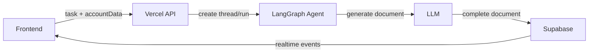

# AI Diff System - Agent Integration Guide (Revised)

## 🎯 Overview

This guide explains how to modify the LangGraph agent to support document editing mode. The agent will analyze existing documents and return structured edit suggestions that integrate with the **already working** frontend diff system.

## ⚡ Key Change
Since the diff visualization system (Phase 2) is already complete and working, we only need to focus on getting structured edit suggestions from the AI and creating diff marks from them.

## 🏗️ Architecture

### Current Flow (Generation)


### New Flow (Editing)

```mermaid
graph LR
    A[Frontend] -->|instruction + document + mode=edit| B[Vercel API]
    B -->|create thread/run| C[LangGraph Agent]
    C -->|analyze document| D[LLM]
    D -->|edit suggestions JSON| E[Supabase]
    E -->|realtime events| F[Frontend]
    F -->|process suggestions| G[Create Diff Marks]
    G -->|user clicks marks| H[Accept/Reject]
```


## 📝 Agent Modifications

### 1. Update AgentState

```python
class AgentState(TypedDict):
    # Existing fields
    task: str
    account_data: Dict[str, Any]
    document_id: str
    document_content: str
    complete: bool
    user_id: str
    thread_id: str
    run_id: str
    
    # New fields for editing
    mode: str  # "generate" | "edit"
    existing_document_content: str  # Current document to edit
    edit_suggestions: Dict[str, Any]  # Structured edit response
    edit_context: Dict[str, Any]  # Additional context for edits
```

### 2. Add Edit Document Function

```python
async def edit_document(state: AgentState) -> AgentState:
    """Generate edit suggestions for existing document"""
    
    # Validate we're in edit mode
    if state.get("mode") != "edit":
        state["complete"] = True
        return state
    
    print(f"[Agent] Starting edit mode for document: {state['document_id']}")
    
    # Log start event
    await log_event(state, "edit_start", "Analyzing document for edits", {
        "instruction": state["task"],
        "document_length": len(state.get("existing_document_content", ""))
    })
    
    # Create edit prompt
    edit_prompt = f"""You are an AI document editor. Analyze the document and suggest edits based on the user's instruction.

USER INSTRUCTION: {state['task']}

CURRENT DOCUMENT:
{state['existing_document_content']}

Provide edit suggestions in this EXACT JSON format:
{{
  "edits": [
    {{
      "id": "edit-001",
      "type": "modification",
      "target": "exact text to find",
      "replacement": "new text",
      "occurrences": [1, 3, 5],
      "confidence": 0.95,
      "reason": "why this change"
    }}
  ],
  "summary": "Brief summary of changes"
}}

Rules:
1. Use 1-based indexing for occurrences
2. Group related changes with the same edit ID
3. Include confidence scores (0-1)
4. For deletions, set replacement to null
5. For additions, use afterText and occurrence fields
6. Be precise with target text matches

Focus on accuracy. Only suggest changes that directly address the instruction."""

    try:
        # Get edit suggestions from LLM
        response = await llm.ainvoke(edit_prompt)
        
        # Parse JSON response
        import json
        edit_suggestions = json.loads(response.content)
        
        # Validate response structure
        if "edits" not in edit_suggestions:
            raise ValueError("Invalid response format: missing 'edits' field")
        
        # Store suggestions
        state["edit_suggestions"] = edit_suggestions
        
        # Log edit suggestions event
        await log_event(state, "edit_suggestions", "Generated edit suggestions", {
            "suggestions": edit_suggestions,
            "edit_count": len(edit_suggestions.get("edits", [])),
            "content_type": "edit_suggestions"  # Special marker for frontend
        })
        
    except json.JSONDecodeError as e:
        error_msg = f"Failed to parse LLM response as JSON: {str(e)}"
        print(f"[Agent] ERROR: {error_msg}")
        await log_event(state, "error", error_msg)
        
        # Fallback: try to extract JSON from response
        try:
            import re
            json_match = re.search(r'\{.*\}', response.content, re.DOTALL)
            if json_match:
                state["edit_suggestions"] = json.loads(json_match.group())
            else:
                state["edit_suggestions"] = {"edits": [], "error": "Could not parse response"}
        except:
            state["edit_suggestions"] = {"edits": [], "error": "Invalid LLM response format"}
    
    except Exception as e:
        error_msg = f"Error generating edit suggestions: {str(e)}"
        print(f"[Agent] ERROR: {error_msg}")
        await log_event(state, "error", error_msg)
        state["edit_suggestions"] = {"edits": [], "error": str(e)}
    
    # Mark complete
    state["complete"] = True
    await log_event(state, "edit_complete", "Edit analysis complete", {
        "total_edits": len(state.get("edit_suggestions", {}).get("edits", []))
    })
    
    return state
```

### 3. Update Workflow

```python
def build_graph():
    workflow = StateGraph(AgentState)
    
    # Add both nodes
    workflow.add_node("generate", generate_document_with_timeout)
    workflow.add_node("edit", edit_document)
    
    # Conditional entry based on mode
    def route_by_mode(state: AgentState) -> str:
        mode = state.get("mode", "generate")
        print(f"[Agent] Routing to mode: {mode}")
        return mode
    
    # Set conditional entry point
    workflow.add_conditional_edges(
        START,
        route_by_mode,
        {
            "generate": "generate",
            "edit": "edit"
        }
    )
    
    # Both lead to END
    workflow.add_edge("generate", END)
    workflow.add_edge("edit", END)
    
    return workflow.compile()
```

## 🔌 API Integration

### Update `/api/langgraph/start.js`

```javascript
const { 
  prompt, 
  accountData, 
  userId, 
  documentId,
  mode = "generate",  // New parameter
  documentContent     // Current document for edit mode
} = parsedBody;

// Validate edit mode requirements
if (mode === "edit" && !documentContent) {
  res.statusCode = 400;
  res.end(JSON.stringify({ 
    error: "Document content required for edit mode" 
  }));
  return;
}

const run = await client.runs.create(thread.thread_id, 'document_generator', {
  input: { 
    task: prompt, 
    account_data: accountData,
    user_id: userId,
    document_id: documentId,
    thread_id: thread.thread_id,
    mode: mode,  // Pass mode to agent
    existing_document_content: documentContent  // For edit mode
  },
  multitaskStrategy: 'enqueue'
});
```

## 🎨 Frontend Integration

### Update AIChat Hook

```javascript
// In useAIChat.js
const requestDocumentEdit = async (instruction, documentContent) => {
  const response = await fetch('/api/langgraph/start', {
    method: 'POST',
    headers: { 'Content-Type': 'application/json' },
    body: JSON.stringify({
      prompt: instruction,
      accountData: account,
      userId: user.id,
      documentId: documentId,
      mode: 'edit',  // Set edit mode
      documentContent: documentContent  // Current document
    })
  });
  
  // Handle response...
};
```

### Handle Edit Suggestions in Realtime

```javascript
// In subscription handler
if (newMessage.event_data?.content_type === 'edit_suggestions') {
  const suggestions = newMessage.event_data.suggestions;
  
  // Process edit suggestions through diff system
  processEditSuggestions(suggestions);
}
```

## 🧪 Testing Strategy

### 1. Agent Testing

```python
# Test edit mode
test_state = {
    "task": "Remove all mentions of version 1.0",
    "mode": "edit",
    "existing_document_content": "The API uses version 1.0...",
    "document_id": "test-123",
    "user_id": "user-123",
    "account_data": {"id": "acc-123", "name": "Test"}
}

result = await graph.ainvoke(test_state)
assert "edit_suggestions" in result
assert len(result["edit_suggestions"]["edits"]) > 0
```

### 2. End-to-End Testing

1. Create document with known content
2. Request edit with specific instruction
3. Verify edit suggestions match expected format
4. Apply suggestions and verify document changes

## 🚀 Phased Rollout

### Phase 1: Basic Edit Mode
- Implement agent edit function
- Return simple modification suggestions
- Test with basic "find and replace" instructions

### Phase 2: Advanced Patterns
- Add contextual search patterns
- Implement confidence scoring
- Handle cascading changes

### Phase 3: Intelligence
- Semantic understanding of instructions
- Multi-step edit sequences
- Context-aware suggestions

## ⚠️ Important Considerations

1. **Token Limits**: Large documents may exceed LLM context
   - Solution: Implement document chunking with overlap
   - Pass relevant sections based on instruction

2. **Response Validation**: LLM may not always return valid JSON
   - Solution: Robust parsing with fallbacks
   - Log malformed responses for debugging

3. **Position Accuracy**: Ensure target text matches exactly
   - Solution: Include hash verification in response
   - Validate matches before creating marks

4. **Performance**: Edit analysis slower than generation
   - Solution: Show progress indicators
   - Stream partial results if possible

## 📊 Monitoring

Add metrics for:
- Edit suggestion accuracy
- Average confidence scores
- Failed parsing attempts
- Time to generate suggestions
- User acceptance rates

This integration maintains backward compatibility while adding powerful edit capabilities to your document system. 