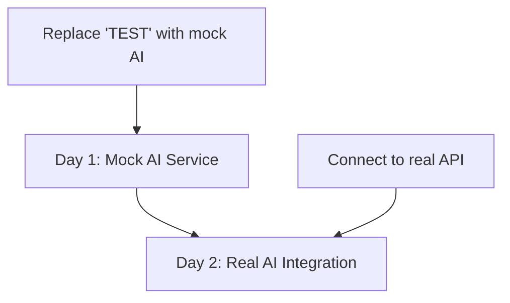

# AI Diff System - Implementation Plan (FINAL)

## 🎉 Major Update: Diff System Already Works!

**What we discovered:**
- ✅ There's already a "Test Diff" button that creates modifications
- ✅ It shows "TEST" as replacement text  
- ✅ Accept/reject works perfectly
- ✅ Position tracking is flawless

**Your only task:** Replace "TEST" with AI-generated suggestions!

## 📊 Simplified Implementation Plan



## 🚀 Day 1: Mock AI Service (2-3 hours)

### Current Working Code (Line 762 DocumentEditorPage.jsx):
```javascript
// This already works perfectly!
const change = {
  type: 'modification',
  originalText: selectedText,
  suggestedText: 'TEST', // <-- ONLY THIS NEEDS TO CHANGE
  position: { from: selection.from, to: selection.to }
};
editor.commands.addChange(change);
```

### Step 1: Create Mock AI Service
```javascript
// src/services/mockAIService.js
export async function generateEdits(text, instruction) {
  // Simulate AI processing delay
  await new Promise(resolve => setTimeout(resolve, 500));
  
  return {
    edits: [{
      id: "edit-001",
      type: "modification",
      target: text,
      replacement: `[AI MOCK] ${text} (made more formal)`,
      occurrences: [1],
      confidence: 0.95,
      reason: "Made text more formal as requested"
    }],
    summary: "Generated 1 modification"
  };
}
```

### Step 2: Update Button Handler
```javascript
// Replace the onClick handler:
onClick={async () => {
  const { selection } = editor.state;
  const selectedText = editor.state.doc.textBetween(selection.from, selection.to);
  
  // Get AI suggestion instead of hardcoded "TEST"
  const response = await mockAIService.generateEdits(
    selectedText, 
    "make it more formal"
  );
  
  const change = {
    type: 'modification',
    originalText: selectedText,
    suggestedText: response.edits[0].replacement, // <-- AI suggestion!
    position: { from: selection.from, to: selection.to }
  };
  
  if (!editor.storage.diffV2?.isActive) {
    editor.commands.toggleDiffMode();
  }
  
  editor.commands.addChange(change);
}}
```

### Test It!
1. Select text
2. Click Test Diff
3. Should see AI-generated suggestion (not "TEST")
4. Accept/reject still works perfectly

## 🤖 Day 2: Real AI Integration (3-4 hours)

### Step 1: Create Edit Processor
```javascript
// src/utils/editProcessor.js
export function findAllOccurrences(editor, targetText) {
  const doc = editor.state.doc;
  const positions = [];
  
  doc.descendants((node, pos) => {
    if (node.isText) {
      let index = node.text.indexOf(targetText);
      while (index !== -1) {
        positions.push({
          from: pos + index,
          to: pos + index + targetText.length
        });
        index = node.text.indexOf(targetText, index + 1);
      }
    }
  });
  
  return positions;
}

export function processMultipleEdits(editor, aiResponse) {
  aiResponse.edits.forEach(edit => {
    if (edit.occurrences && edit.occurrences.length > 1) {
      // Handle multiple occurrences
      const positions = findAllOccurrences(editor, edit.target);
      
      edit.occurrences.forEach(num => {
        const pos = positions[num - 1]; // Convert to 0-based
        if (pos) {
          editor.commands.addChange({
            type: edit.type,
            originalText: edit.target,
            suggestedText: edit.replacement,
            position: pos,
            metadata: { confidence: edit.confidence }
          });
        }
      });
    } else {
      // Single edit (current selection)
      const { selection } = editor.state;
      editor.commands.addChange({
        type: edit.type,
        originalText: edit.target,
        suggestedText: edit.replacement,
        position: { from: selection.from, to: selection.to }
      });
    }
  });
}
```

### Step 2: Connect to Real API
```javascript
// Update button to use real AI
onClick={async () => {
  setLoading(true);
  try {
    const response = await langGraphClient.requestEdit({
      text: selectedText,
      instruction: userInstruction,
      documentId: docId
    });
    
    processMultipleEdits(editor, response);
  } catch (error) {
    console.error('AI request failed:', error);
    alert('Failed to get AI suggestions');
  } finally {
    setLoading(false);
  }
}}
```

## ✅ That's It!

### What NOT to Do:
- ❌ Don't modify DiffExtensionV2.js
- ❌ Don't touch DiffMark.js
- ❌ Don't change DiffOverlay.jsx
- ❌ Don't reimplement position tracking
- ❌ Don't create new UI components

### Quick Verification:
```javascript
// This already works! Try it in console:
editor.commands.addChange({
  type: 'modification',
  originalText: 'test',
  suggestedText: 'examination',
  position: { from: 10, to: 14 }
});
```

## 📈 Success Metrics

- **Implementation Time**: 2 days (not 2 weeks!)
- **Code to Write**: ~100 lines (not 1000s)
- **Components to Build**: 0 (already done!)

## 🎉 Summary

The diff system is a working Ferrari. You're just changing what fuel goes in:
- Before: `suggestedText: 'TEST'`
- After: `suggestedText: aiResponse.replacement`

That's literally the entire implementation! 