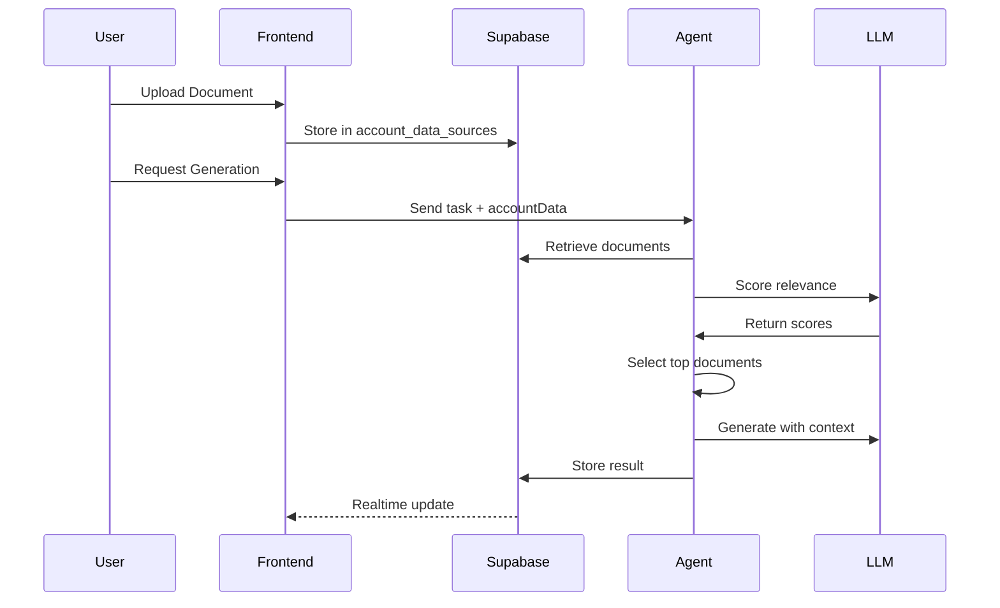

# Knowledge Graph Architecture Analysis

## Executive Summary

This document provides a comprehensive analysis of the current SE Auto MVP architecture and how a knowledge graph visualization system can be integrated to enhance the user experience of the AI context/RAG system.

## Current Architecture Deep Dive

### 1. Document Upload & Storage Pipeline

#### Current Flow
```
User → FileUploadDropzone → documentProcessor → Supabase (account_data_sources)
```

#### Key Components

**FileUploadDropzone (`src/components/FileUploadDropzone.jsx`)**
- Accepts: PDF, DOCX, DOC, TXT, MD, RTF files
- Max size: 50MB
- Drag-and-drop interface
- Single file processing (maxFiles=1 default)

**documentProcessor (`src/services/documentProcessor.js`)**
- Extracts text content from various formats
- Converts to HTML for storage
- Extracts metadata (word count, page count)
- Progress callback for UI updates

**Storage Schema (`account_data_sources` table)**
```sql
- id: UUID
- account_id: UUID (FK to accounts)
- file_name: TEXT
- file_type: TEXT
- content: TEXT (HTML)
- metadata: JSONB
- created_at: TIMESTAMPTZ
```

### 2. AI Agent Retrieval System

#### Retrieval Process
1. **Document Fetching**: `supabase_manager.retrieve_account_documents()`
   - Fetches up to 20 documents for an account
   - Orders by creation date (newest first)

2. **Relevance Scoring**: LLM-based scoring (0.0-1.0)
   - Uses "Research Specialist" persona
   - Evaluates strategic insights beyond keywords
   - Returns reasoning for each score

3. **Context Selection**: Top 5 documents with score > 0.6
   - Creates curated context snippets
   - Includes relevance reasoning
   - Limited to 1000 chars per document

#### Agent State Management
```python
AgentState = {
    retrieved_documents: List[RetrievedDocument],
    selected_context: str,  # Curated context from docs
    # ... other fields
}
```

### 3. Current UI/UX

#### Context Files Section
- Lists uploaded files with metadata
- Shows file type icons
- Delete functionality
- "Edit in Editor" button (disabled)
- No visualization of relationships or usage

#### AI Chat Integration
- Shows agent activity in chat
- Event-based updates via Supabase realtime
- Limited visibility into which documents are being used

### 4. Data Flow Analysis



## Architecture Strengths

1. **Clean Separation**: Document storage separate from generation
2. **Scalable Storage**: Supabase handles large content well
3. **Flexible Metadata**: JSONB allows extensibility
4. **Real-time Updates**: Built-in Supabase subscriptions
5. **LLM Scoring**: Intelligent relevance detection

## Architecture Limitations

1. **No Relationship Tracking**: Documents are isolated
2. **Limited Metadata**: Missing embedding/vector data
3. **No Visualization**: Text lists only
4. **No Cross-Account Knowledge**: Account silos
5. **No Usage Analytics**: Can't see what's most valuable

## Integration Opportunities

### 1. Minimal Changes Required
- Existing retrieval system provides scores (similarity)
- Document metadata can store position/cluster info
- Real-time subscriptions ready for live updates

### 2. Extension Points
- `documentProcessor` can extract more metadata
- `metadata` JSONB field can store graph data
- Agent already sends retrieval events

### 3. New Components Needed
- Graph visualization component
- Relationship calculation service
- Position/layout algorithm
- Cross-account knowledge system

## Technical Constraints

1. **No Current Embeddings**: Need to add vector generation
2. **Single Account Scope**: Need to design for global knowledge
3. **Limited Processing**: Client-side only currently
4. **No Background Jobs**: Everything synchronous

## Recommended Architecture Changes

### 1. Add Vector/Embedding Support
```sql
ALTER TABLE account_data_sources 
ADD COLUMN embedding vector(1536),
ADD COLUMN embedding_model TEXT;
```

### 2. Add Relationship Tracking
```sql
CREATE TABLE document_relationships (
    source_doc_id UUID,
    target_doc_id UUID,
    similarity_score FLOAT,
    relationship_type TEXT
);
```

### 3. Add Graph Metadata
```sql
ALTER TABLE account_data_sources
ADD COLUMN graph_position JSONB,  -- {x, y, z}
ADD COLUMN cluster_id UUID,
ADD COLUMN importance_score FLOAT;
```

### 4. Add Global Knowledge Table
```sql
CREATE TABLE global_knowledge_base (
    -- Similar structure to account_data_sources
    -- But accessible across all accounts
);
```

## Performance Considerations

1. **Current Scale**: ~10-50 documents per account
2. **Graph Rendering**: Need virtualization for 1000+ nodes
3. **Embedding Computation**: Async/batch processing needed
4. **Real-time Updates**: Debouncing for smooth animations

## Security Considerations

1. **RLS Policies**: Maintain account isolation
2. **Global Knowledge**: New permission model needed
3. **Cross-Account**: Careful data exposure

## Conclusion

The current architecture provides a solid foundation for adding knowledge graph visualization. The main additions needed are:

1. Vector/embedding support for true semantic relationships
2. Relationship tracking between documents
3. Graph visualization components
4. Global knowledge base support

The existing document processing pipeline, storage system, and real-time infrastructure can be extended rather than replaced, making this a feasible enhancement that adds significant value to the user experience. 