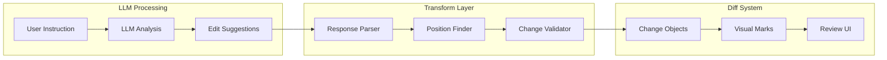

# LLM to Diff System Integration Guide

## 🎯 Overview

This guide explains how to transform LLM-generated edit suggestions into visual diff marks that users can review and accept/reject. The integration bridges the gap between AI intelligence and user control.

## 🏗️ Integration Architecture



## 📋 LLM Response Formats

### Format 1: Structured JSON Response

```javascript
{
  "analysis": "Found 5 mentions of 'v1.0' that should be updated",
  "changes": [
    {
      "type": "modification",
      "searchText": "API v1.0 endpoint",
      "originalText": "v1.0",
      "suggestedText": "v2.0",
      "reason": "Version update requested",
      "confidence": 0.95,
      "context": {
        "before": "Using the ",
        "after": " endpoint for"
      }
    },
    {
      "type": "deletion",
      "searchText": "Legacy v1.0 authentication is still supported",
      "originalText": "Legacy v1.0 authentication is still supported",
      "suggestedText": "",
      "reason": "Remove mentions of old version",
      "confidence": 0.90
    },
    {
      "type": "addition",
      "searchText": "## Authentication",
      "originalText": "",
      "suggestedText": "\n\n> **Note**: v2.0 uses OAuth 2.0 flow",
      "reason": "Add version clarification",
      "confidence": 0.85,
      "position": "after"
    }
  ]
}
```

### Format 2: Natural Language with Markers

```
I found several places that need updating:

<<CHANGE_START type="modification" id="1">>
ORIGINAL: The API uses v1.0 protocol
SUGGESTED: The API uses v2.0 protocol
REASON: Update version reference
<<CHANGE_END>>

<<CHANGE_START type="deletion" id="2">>
ORIGINAL: Note that v1.0 is being deprecated in Q4 2024.
REASON: Remove outdated deprecation notice
<<CHANGE_END>>
```

### Format 3: Diff-Style Format

```diff
@@ Line 45: API Documentation @@
- const apiUrl = "https://api.example.com/v1.0/users";
+ const apiUrl = "https://api.example.com/v2.0/users";

@@ Line 67: Authentication Section @@
- // v1.0 uses API keys
- const headers = { 'X-API-Key': apiKey };
+ // v2.0 uses Bearer tokens
+ const headers = { 'Authorization': `Bearer ${token}` };
```

## 🔄 Processing Pipeline

### Step 1: Parse LLM Response

```javascript
class LLMResponseParser {
  parse(llmResponse) {
    // Handle different response formats
    if (typeof llmResponse === 'string') {
      return this.parseNaturalLanguage(llmResponse);
    } else if (llmResponse.changes) {
      return this.parseStructured(llmResponse);
    } else if (llmResponse.includes('@@')) {
      return this.parseDiffFormat(llmResponse);
    }
  }

  parseStructured(response) {
    return response.changes.map(change => ({
      ...change,
      id: `llm-${Date.now()}-${Math.random().toString(36).substr(2, 9)}`
    }));
  }

  parseNaturalLanguage(text) {
    const changes = [];
    const regex = /<<CHANGE_START([^>]+)>>([\s\S]*?)<<CHANGE_END>>/g;
    let match;
    
    while ((match = regex.exec(text)) !== null) {
      const attributes = this.parseAttributes(match[1]);
      const content = match[2];
      
      changes.push(this.parseChangeContent(attributes, content));
    }
    
    return changes;
  }
}
```

### Step 2: Find Text Positions

```javascript
class PositionFinder {
  constructor(editor) {
    this.editor = editor;
  }

  findPositions(change) {
    // Strategy 1: Exact text match
    const exactPos = this.findExactMatch(change.searchText || change.originalText);
    if (exactPos) return exactPos;

    // Strategy 2: Fuzzy match with context
    if (change.context) {
      const fuzzyPos = this.findWithContext(
        change.originalText,
        change.context.before,
        change.context.after
      );
      if (fuzzyPos) return fuzzyPos;
    }

    // Strategy 3: Semantic search (for modifications)
    if (change.type === 'modification') {
      const semanticPos = this.findSemantically(change);
      if (semanticPos) return semanticPos;
    }

    // Strategy 4: Line-based search
    if (change.lineNumber) {
      return this.findByLine(change.lineNumber);
    }

    return null;
  }

  findExactMatch(searchText) {
    let found = null;
    
    this.editor.state.doc.descendants((node, pos) => {
      if (node.isText && !found) {
        const index = node.text.indexOf(searchText);
        if (index !== -1) {
          found = {
            from: pos + index,
            to: pos + index + searchText.length
          };
          return false; // Stop searching
        }
      }
    });
    
    return found;
  }

  findWithContext(text, before, after) {
    const fullPattern = `${before}${text}${after}`;
    const position = this.findExactMatch(fullPattern);
    
    if (position) {
      // Adjust position to target text only
      return {
        from: position.from + before.length,
        to: position.from + before.length + text.length
      };
    }
    
    return null;
  }

  findSemantically(change) {
    // For paragraphs or larger blocks
    const doc = this.editor.state.doc;
    let bestMatch = null;
    let bestScore = 0;
    
    doc.descendants((node, pos) => {
      if (node.type.name === 'paragraph' || node.type.name === 'heading') {
        const similarity = this.calculateSimilarity(
          node.textContent,
          change.originalText
        );
        
        if (similarity > bestScore && similarity > 0.8) {
          bestScore = similarity;
          bestMatch = { from: pos, to: pos + node.nodeSize };
        }
      }
    });
    
    return bestMatch;
  }

  calculateSimilarity(text1, text2) {
    // Simple similarity calculation (can be enhanced)
    const words1 = text1.toLowerCase().split(/\s+/);
    const words2 = text2.toLowerCase().split(/\s+/);
    const intersection = words1.filter(w => words2.includes(w));
    return intersection.length / Math.max(words1.length, words2.length);
  }
}
```

### Step 3: Validate and Transform Changes

```javascript
class ChangeValidator {
  constructor(editor) {
    this.editor = editor;
  }

  validateAndTransform(parsedChanges, positions) {
    const validChanges = [];
    
    for (let i = 0; i < parsedChanges.length; i++) {
      const change = parsedChanges[i];
      const position = positions[i];
      
      if (!position) {
        console.warn(`Could not find position for change: ${change.id}`);
        continue;
      }
      
      // Validate position bounds
      const docSize = this.editor.state.doc.content.size;
      if (position.from < 0 || position.to > docSize) {
        console.warn(`Invalid position for change: ${change.id}`);
        continue;
      }
      
      // Transform to diff system format
      const diffChange = {
        id: change.id,
        type: change.type,
        position: position,
        originalText: change.originalText || this.getTextAt(position),
        suggestedText: change.suggestedText || '',
        metadata: {
          reason: change.reason,
          confidence: change.confidence || 0.5,
          source: 'llm',
          timestamp: new Date().toISOString()
        }
      };
      
      // Special handling for additions
      if (change.type === 'addition') {
        diffChange.position = this.adjustAdditionPosition(position, change);
      }
      
      validChanges.push(diffChange);
    }
    
    return validChanges;
  }

  getTextAt(position) {
    const { from, to } = position;
    return this.editor.state.doc.textBetween(from, to);
  }

  adjustAdditionPosition(position, change) {
    // For additions, determine exact insertion point
    if (change.position === 'after') {
      return { from: position.to, to: position.to };
    } else if (change.position === 'before') {
      return { from: position.from, to: position.from };
    }
    // Default: at the end
    return { from: position.to, to: position.to };
  }
}
```

## 🎨 Complete Integration Service

```javascript
class AIEditService {
  constructor(editor) {
    this.editor = editor;
    this.parser = new LLMResponseParser();
    this.finder = new PositionFinder(editor);
    this.validator = new ChangeValidator(editor);
  }

  async processLLMResponse(instruction, llmResponse) {
    console.log('Processing LLM response for instruction:', instruction);
    
    try {
      // 1. Parse the response
      const parsedChanges = this.parser.parse(llmResponse);
      console.log(`Parsed ${parsedChanges.length} changes`);
      
      // 2. Find positions for each change
      const positions = parsedChanges.map(change => 
        this.finder.findPositions(change)
      );
      
      // 3. Validate and transform
      const validChanges = this.validator.validateAndTransform(
        parsedChanges,
        positions
      );
      
      console.log(`${validChanges.length} valid changes ready to apply`);
      
      // 4. Apply to diff system
      return this.applyChanges(validChanges);
      
    } catch (error) {
      console.error('Error processing LLM response:', error);
      return { success: false, error: error.message };
    }
  }

  applyChanges(changes) {
    // Enable diff mode if not already active
    if (!this.editor.storage.diffV2?.isActive) {
      this.editor.commands.toggleDiffMode();
    }
    
    // Group related changes
    const groups = this.groupChanges(changes);
    
    // Apply changes
    const results = [];
    for (const [groupId, groupChanges] of Object.entries(groups)) {
      if (groupChanges.length === 1) {
        // Single change
        const success = this.editor.commands.addChange(groupChanges[0]);
        results.push({ change: groupChanges[0], success });
      } else {
        // Batch of related changes
        this.editor.commands.addChangeBatch(groupId, groupChanges);
        results.push({ batch: groupId, count: groupChanges.length });
      }
    }
    
    return {
      success: true,
      applied: changes.length,
      results
    };
  }

  groupChanges(changes) {
    // Group by proximity and type
    const groups = {};
    
    changes.forEach(change => {
      // Find existing group within 100 characters
      let assigned = false;
      
      for (const [groupId, group] of Object.entries(groups)) {
        const lastChange = group[group.length - 1];
        const distance = Math.abs(change.position.from - lastChange.position.to);
        
        if (distance < 100 && change.metadata.reason === lastChange.metadata.reason) {
          group.push(change);
          assigned = true;
          break;
        }
      }
      
      if (!assigned) {
        const groupId = `group-${Object.keys(groups).length + 1}`;
        groups[groupId] = [change];
      }
    });
    
    return groups;
  }
}
```

## 🔌 Integration with Existing System

### Option 1: Via Supabase Realtime

```javascript
// In useAIChat.js or similar
useEffect(() => {
  const subscription = supabase
    .channel(`chat_messages:${documentId}`)
    .on('postgres_changes', {
      event: 'INSERT',
      schema: 'public',
      table: 'chat_messages'
    }, (payload) => {
      if (payload.new.event_data?.type === 'edit_suggestions') {
        const editService = new AIEditService(editor);
        editService.processLLMResponse(
          payload.new.content, // The instruction
          payload.new.event_data.suggestions
        );
      }
    })
    .subscribe();
    
  return () => subscription.unsubscribe();
}, [documentId, editor]);
```

### Option 2: Direct API Response

```javascript
// In document editor component
const handleAIEdit = async (instruction) => {
  setProcessing(true);
  
  try {
    // Call your AI endpoint
    const response = await fetch('/api/ai/edit', {
      method: 'POST',
      headers: { 'Content-Type': 'application/json' },
      body: JSON.stringify({
        documentId,
        instruction,
        documentContent: editor.getHTML()
      })
    });
    
    const { suggestions } = await response.json();
    
    // Process suggestions
    const editService = new AIEditService(editor);
    const result = await editService.processLLMResponse(instruction, suggestions);
    
    if (result.success) {
      toast.success(`Applied ${result.applied} suggested changes`);
    }
    
  } catch (error) {
    toast.error('Failed to get AI suggestions');
  } finally {
    setProcessing(false);
  }
};
```

## 🧪 Testing Strategies

### 1. Mock LLM Responses

```javascript
const mockLLMResponses = {
  'update_version': {
    analysis: "Found version references to update",
    changes: [
      {
        type: "modification",
        searchText: "v1.0",
        originalText: "v1.0",
        suggestedText: "v2.0",
        reason: "Version update"
      }
    ]
  },
  
  'remove_deprecated': {
    analysis: "Identifying deprecated content",
    changes: [
      {
        type: "deletion",
        searchText: "This feature is deprecated",
        originalText: "This feature is deprecated and will be removed.",
        suggestedText: "",
        reason: "Remove deprecated notice"
      }
    ]
  }
};

// Test function
function testAIEditing() {
  const editor = window.editor;
  const editService = new AIEditService(editor);
  
  // Test with mock response
  const mockResponse = mockLLMResponses['update_version'];
  editService.processLLMResponse('Update to v2.0', mockResponse);
}
```

### 2. Position Finding Tests

```javascript
describe('PositionFinder', () => {
  it('finds exact text matches', () => {
    const finder = new PositionFinder(editor);
    const pos = finder.findExactMatch('Hello world');
    expect(pos).toEqual({ from: 1, to: 12 });
  });
  
  it('finds text with context', () => {
    const finder = new PositionFinder(editor);
    const pos = finder.findWithContext('world', 'Hello ', '!');
    expect(pos).toEqual({ from: 7, to: 12 });
  });
  
  it('handles missing text gracefully', () => {
    const finder = new PositionFinder(editor);
    const pos = finder.findExactMatch('Not in document');
    expect(pos).toBeNull();
  });
});
```

## 🚨 Common Pitfalls & Solutions

### 1. Position Accuracy

**Problem**: LLM provides approximate text that doesn't exactly match document.

**Solution**: Use fuzzy matching with context:
```javascript
// Instead of exact match
const pos = finder.findExactMatch("API v1.0");

// Use context-aware search
const pos = finder.findWithContext("v1.0", "API ", " endpoint");
```

### 2. Overlapping Changes

**Problem**: Multiple changes affect the same text region.

**Solution**: Sort and merge overlapping changes:
```javascript
function mergeOverlappingChanges(changes) {
  // Sort by position
  changes.sort((a, b) => a.position.from - b.position.from);
  
  const merged = [];
  let current = changes[0];
  
  for (let i = 1; i < changes.length; i++) {
    const next = changes[i];
    
    if (current.position.to >= next.position.from) {
      // Overlapping - merge
      current = {
        ...current,
        position: {
          from: current.position.from,
          to: Math.max(current.position.to, next.position.to)
        },
        suggestedText: current.suggestedText + next.suggestedText
      };
    } else {
      merged.push(current);
      current = next;
    }
  }
  
  merged.push(current);
  return merged;
}
```

### 3. Performance with Large Documents

**Problem**: Finding positions in large documents is slow.

**Solution**: Use indexed search with caching:
```javascript
class IndexedPositionFinder extends PositionFinder {
  constructor(editor) {
    super(editor);
    this.indexCache = this.buildIndex();
  }
  
  buildIndex() {
    const index = new Map();
    
    this.editor.state.doc.descendants((node, pos) => {
      if (node.isText) {
        // Index words with their positions
        const words = node.text.split(/\s+/);
        let offset = 0;
        
        for (const word of words) {
          if (!index.has(word)) {
            index.set(word, []);
          }
          index.get(word).push(pos + offset);
          offset += word.length + 1;
        }
      }
    });
    
    return index;
  }
}
```

## 🎯 Best Practices

### 1. Confidence Thresholds

Only apply high-confidence changes automatically:
```javascript
const AUTO_APPLY_THRESHOLD = 0.9;

validChanges.forEach(change => {
  if (change.metadata.confidence >= AUTO_APPLY_THRESHOLD) {
    editor.commands.addChange(change);
  } else {
    // Add to review queue
    pendingReview.push(change);
  }
});
```

### 2. Change Batching

Group related changes for better UX:
```javascript
// Good: Group all version updates
editor.commands.addChangeBatch('version-update', [
  { type: 'modification', originalText: 'v1.0', suggestedText: 'v2.0' },
  { type: 'modification', originalText: 'version 1', suggestedText: 'version 2' }
]);

// Bad: Individual changes
changes.forEach(c => editor.commands.addChange(c));
```

### 3. User Feedback Loop

Track acceptance rates to improve future suggestions:
```javascript
const trackUserDecision = async (change, decision) => {
  await supabase.table('ai_feedback').insert({
    change_type: change.type,
    instruction_type: change.metadata.instructionType,
    confidence: change.metadata.confidence,
    decision: decision, // 'accepted' or 'rejected'
    timestamp: new Date()
  });
};
```

## 🔮 Future Enhancements

### 1. Smart Conflict Resolution

When changes conflict, let AI resolve:
```javascript
const resolveConflicts = async (conflicts) => {
  const resolution = await ai.resolveEditConflicts(conflicts);
  return resolution.preferredChanges;
};
```

### 2. Learning from Patterns

Detect and apply common patterns:
```javascript
// If user always accepts "v1 -> v2" changes
// Auto-apply similar changes with high confidence
```

### 3. Semantic Understanding

Move beyond text matching to semantic changes:
```javascript
// "Make this paragraph more concise"
// "Change tone to be more formal"
// "Update to match company style guide"
```

This integration guide provides a robust foundation for connecting LLM intelligence with user-controlled document editing. 