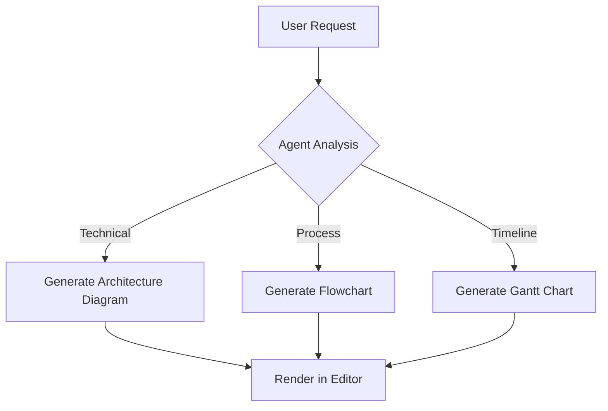
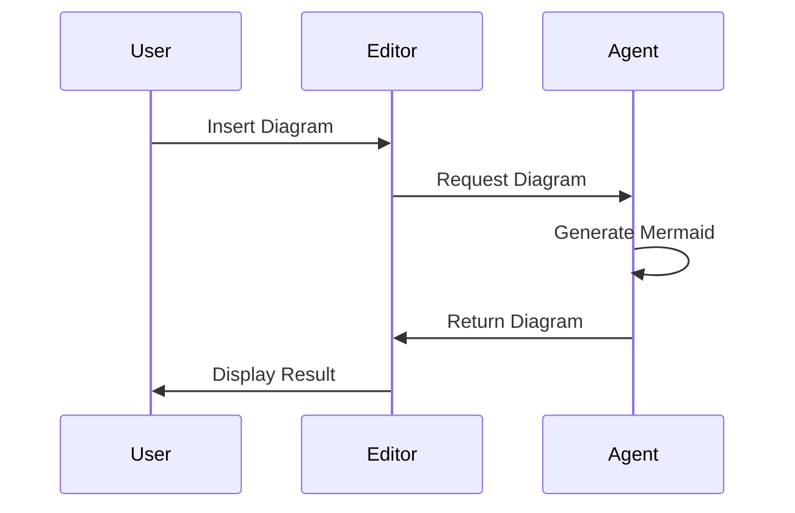

# Mermaid Diagram Support Implementation Plan

## Executive Summary

This document outlines a 4-phase approach to adding Mermaid diagram support to both the TipTap editor and the AI document generation agent. The implementation leverages existing architecture patterns from the DiffExtension and maintains compatibility with the current markdown-based document flow. Total implementation time: 7 weeks.

## Current State Analysis

### Editor Architecture
- **TipTap Version**: 2.25.0 with modular extension system
- **Existing Extensions**: StarterKit, formatting extensions, and custom DiffExtension
- **Styling**: Dark theme with glassmorphic design and cyan accents
- **Toolbar**: Inline implementation with formatting buttons

### Agent Architecture
- **Document Format**: Markdown-first approach
- **Conversion Flow**: Markdown → HTML for display, bidirectional conversion for exports
- **Extended Syntax**: Already supports tables, task lists, strikethrough
- **Export Formats**: Markdown, HTML, PDF, DOCX, plain text

### Key Strengths to Leverage
1. Proven extension pattern from DiffExtension
2. Existing markdown-to-HTML conversion pipeline
3. Agent already generates structured markdown
4. Robust export system with format preservation

## Implementation Phases

### Phase 1: Basic Mermaid Rendering (Week 1-2)

#### Objectives
- Render static Mermaid diagrams in the editor
- Support basic diagram types (flowchart, sequence, gantt)
- Enable markdown fence syntax for Mermaid

#### Tasks
1. **Install Dependencies**
   ```bash
   npm install @syfxlin/tiptap-starter-kit mermaid
   ```

2. **Create MermaidExtension**
   - Follow DiffExtension pattern for consistency
   - Implement as a Node extension (not Mark)
   - Support fence syntax: ` ```mermaid `

3. **Update Markdown Converters**
   - Modify `markdownToHtml.js` to preserve mermaid blocks
   - Update `documentProcessor.js` for mermaid recognition
   - Ensure bidirectional conversion works

4. **Basic Styling**
   - Add mermaid-specific CSS to index.css
   - Match dark theme aesthetics
   - Ensure diagrams are readable

#### Deliverables
- [ ] MermaidExtension.js file
- [ ] Updated markdown converters
- [ ] Basic CSS styling
- [ ] Unit tests for conversion

### Phase 2: Editor Integration (Week 3-4)

#### Objectives
- Add toolbar button for inserting diagrams
- Implement diagram editing UI
- Add error handling for invalid syntax

#### Tasks
1. **Toolbar Integration**
   - Add Mermaid button to toolbar
   - Create diagram insertion modal
   - Provide diagram type templates

2. **Edit Experience**
   - Click to edit diagram source
   - Live preview while editing
   - Syntax validation and error display

3. **Keyboard Shortcuts**
   - Cmd/Ctrl + M for new diagram
   - Enter to edit existing diagram

4. **Error Handling**
   - Graceful fallback for invalid syntax
   - Clear error messages
   - Preserve source code on errors

#### Deliverables
- [ ] Toolbar button component
- [ ] Diagram editor modal
- [ ] Error handling system
- [ ] Keyboard shortcut implementation

### Phase 3: Agent Integration (Week 5-6)

#### Objectives
- Enable AI generation of Mermaid diagrams
- Add diagram generation to appropriate sections
- Implement smart diagram suggestions

#### Tasks
1. **Update Agent Prompts**
   - Add Mermaid syntax to generation prompts
   - Include diagram examples in few-shot learning
   - Define when to use diagrams vs text

2. **Diagram Generation Logic**
   ```python
   # In generation.py
   - Detect content suitable for diagrams
   - Generate appropriate diagram types:
     - Flowcharts for processes
     - Sequence diagrams for interactions
     - Gantt charts for timelines
     - ER diagrams for data models
   ```

3. **Context-Aware Generation**
   - Technical sections → architecture diagrams
   - Process sections → flowcharts
   - Timeline sections → gantt charts

4. **Quality Control**
   - Validate generated Mermaid syntax
   - Ensure diagrams enhance understanding
   - Maintain appropriate complexity

#### Deliverables
- [ ] Updated generation prompts
- [ ] Diagram generation logic
- [ ] Validation system
- [ ] Example outputs

### Phase 4: Export Enhancement (Week 7)

#### Objectives
- Ensure diagrams export correctly to all formats
- Maintain visual fidelity across formats
- Handle fallbacks for incompatible formats

#### Tasks
1. **Export Format Support**
   - **Markdown**: Preserve mermaid fence blocks
   - **HTML**: Render as SVG with fallback
   - **PDF**: Convert to images before export
   - **DOCX**: Embed as images
   - **Plain Text**: Export source code

2. **Rendering Pipeline**
   - Server-side rendering for exports
   - Client-side rendering for preview
   - Caching for performance

3. **Fallback Strategies**
   - Text description for accessibility
   - Source code as fallback
   - Error messages in exports

#### Deliverables
- [ ] Updated export modules
- [ ] Rendering pipeline
- [ ] Fallback system
- [ ] Export tests


## Technical Specifications

### MermaidExtension Architecture
```javascript
// Following DiffExtension pattern
export const MermaidExtension = Node.create({
  name: 'mermaid',
  
  addOptions() {
    return {
      onError: undefined,
      theme: 'dark',
      securityLevel: 'strict'
    }
  },
  
  addCommands() {
    return {
      insertMermaid: (content) => ({ commands }) => {
        // Implementation
      },
      updateMermaid: (content) => ({ commands }) => {
        // Implementation
      }
    }
  }
})
```

### Agent Prompt Addition
```python
# Add to generation prompts
"When appropriate, use Mermaid diagrams to visualize:
- Process flows: ```mermaid\nflowchart TD\n...```
- Sequences: ```mermaid\nsequenceDiagram\n...```
- Timelines: ```mermaid\ngantt\n...```

CRITICAL: Return ONLY the content. Ensure Mermaid syntax is valid."
```

### Export Handling
```javascript
// In markdownExporter.js
const handleMermaidBlocks = (html) => {
  // Preserve mermaid code blocks
  // Convert rendered diagrams back to source
}
```

## Risk Mitigation

### Technical Risks
1. **Performance Impact**
   - Mitigation: Lazy loading, caching, progressive rendering
   
2. **Security Concerns**
   - Mitigation: Strict security level, input sanitization
   
3. **Browser Compatibility**
   - Mitigation: Server-side rendering fallback

### Implementation Risks
1. **Scope Creep**
   - Mitigation: Strict phase boundaries, MVP focus
   
2. **Integration Complexity**
   - Mitigation: Follow existing patterns, incremental testing

## Success Metrics

### Phase 1
- [ ] Render 5 diagram types successfully
- [ ] Zero regression in existing features
- [ ] <100ms render time for average diagram

### Phase 2
- [ ] 90% user success rate for diagram insertion
- [ ] <2 clicks to edit existing diagram
- [ ] Clear error messages for 100% of syntax errors

### Phase 3
- [ ] Agent generates valid diagrams 95% of the time
- [ ] Diagrams improve document clarity (user feedback)
- [ ] Appropriate diagram usage (not overused)

### Phase 4
- [ ] 100% export success rate across formats
- [ ] Visual fidelity maintained in PDF/DOCX
- [ ] Graceful degradation for all edge cases

## Timeline Summary

- **Week 1-2**: Basic rendering (Phase 1)
- **Week 3-4**: Editor integration (Phase 2)
- **Week 5-6**: Agent integration (Phase 3)
- **Week 7**: Export enhancement (Phase 4)
- **Total**: 7 weeks for complete implementation

## Next Steps

1. Review and approve implementation plan
2. Set up development branch
3. Install dependencies
4. Begin Phase 1 implementation

## Nice to Have Items

### DOCX Export Improvements
- Fix numbered list rendering (currently shows as bullet points)
- Add proper numbering definitions to Document configuration
- Support nested lists with correct indentation levels
- Handle mixed list types (ordered inside unordered, etc.)
- Add support for TipTap task lists in DOCX format

### General Export Enhancements
- Improve table formatting across all export formats
- Add support for text alignment preservation
- Enhanced code block styling in PDF/DOCX
- Better handling of inline styles and highlights

## Appendix: Example Implementations

### Simple Flowchart


### Sequence Diagram


This implementation plan provides a structured approach to adding Mermaid support while maintaining system integrity and leveraging existing architectural patterns.